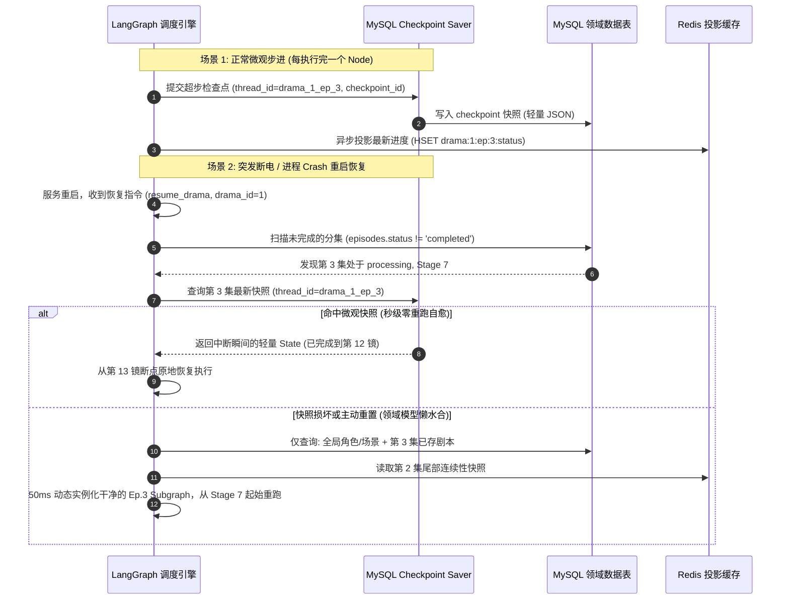

# 剧本创作工坊：分层状态机与持久化执行架构方案
## （CQRS 读写分离、内存降载、第二程多集并行、高韧性断点自愈）

---

## 一、 背景与架构痛点分析

在目前短剧工作流系统的演进中，随着 Stage 1 ~ Stage 8 功能的逐步完备，系统暴露出了几个显著影响工业化扩展与生产稳定性的深层次问题：

1. **“上帝对象 / 巨石状态机”内存雪崩与序列化瓶颈**
   - 当前在 `script_graph_state.py` 中的 `IndustrialDramaMasterState` 采取了单体累加模式，将所有阶段产物（包括可能多达 100 集的文学剧本、上千个分镜镜头、密集机位提示词、多模态参考图、音频混音分轨）全部累加在单个状态对象中。
   - LangGraph 在节点流转时进行深拷贝与序列化，导致在流程中后期单步执行开销与内存占用激增，无法支撑长篇短剧。
2. **缺乏多集并行生成能力**
   - 第二程（Stage 5~8）的单集视听工程属于计算密集型任务，但由于全部绑定在同一个全局状态实例中，导致各集只能串行排队执行，无法有效利用多卡 GPU 或并发外部 API 吞吐能力。
3. **宕机自愈机制脆弱**
   - 依赖全量扫描数据库并由 `load_master_state_from_db` 尝试一次性组装全剧全集状态。一旦发生突发进程崩溃、OOM 或整机断电，重新拼装巨型状态不仅极耗资源，且局部字段异常极易导致全剧恢复失败。
4. **工作便签与微服务读视图定位模糊**
   - 早期设计的短期记忆字段（如 `short_memory_a/b/c/d`）命名随意，且混淆了“状态机调度数据”与“外部微服务/前端展示查询”的边界。

针对以上问题，本方案确定了**“主权在状态机、投影在 Redis、内存极致降载、第二程多集流水线并行、工业级持久化断点续跑”**的一体化架构。

---

## 二、 架构总原则与数据主权分工 (CQRS 体系)

```mermaid
flowchart TB
    subgraph ClientLayer [微服务调用与前端接口层]
        WebAPI[FastAPI Router / SSE 推流]
        WorkerPool[多卡视听渲染 / 外部模型调度器]
    end

    subgraph RedisLayer [Redis 只读投影与连续性缓存 (CQRS Read View)]
        R_State[业务只读状态与进度投影<br/>drama:{id}:read_model]
        R_Mem[阶段工作便签与跨集连续性<br/>drama:{id}:continuity:latest]
        R_SSE[实时生成事件流 Pub/Sub]
    end

    subgraph OrchestrationLayer [调度与执行层: LangGraph 状态机 (主权在 State)]
        direction TB
        subgraph ParentGraph [第一程: 全局文学父图 (Global Master State)]
            P1[Stage 1: 概念创意] --> P2[Stage 2: 角色引擎]
            P2 --> P3[Stage 3: 场景道具]
            P3 --> P4[Stage 4: 节律大纲]
        end
        
        subgraph SubGraphPool [第二程: 单集视听独立子图池 (Episode-Scoped State)]
            direction LR
            EP1[Ep.1 子图: Stage 5~8]
            EP2[Ep.2 子图: Stage 5~8]
            EPN[Ep.N 子图: Stage 5~8]
        end
        ParentGraph -->|分发单集轻量上下文卡片| SubGraphPool
    end

    subgraph DurableEngine [工业级持久化执行引擎 (Durable Checkpointer)]
        MySQLSaver[MySQL Checkpoint Saver / AsyncCheckpoint]
        CheckDB[(MySQL 状态快照表<br/>checkpoints, writes)]
        MySQLSaver <==> CheckDB
        OrchestrationLayer <==>|每步超步自动持久化与秒级恢复| MySQLSaver
    end

    subgraph DomainDB [业务领域真理源 (MySQL 关系模型)]
        D_Drama[(dramas / characters)]
        D_Episode[(episodes / storyboards / audios)]
    end

    subgraph BlobStore [大对象本地/对象存储]
        Files[高清分镜图 / 母带分轨音频 / 生图参考矩阵]
    end

    %% 数据流
    ClientLayer -->|查询进度/只读聚合| R_State
    ClientLayer -->|触发流程/人工干预| OrchestrationLayer
    OrchestrationLayer -.->|异步事件投影| RedisLayer
    OrchestrationLayer ===|哨卡通过后提交定稿数据| DomainDB
    WorkerPool -->|落盘多模态大文件| BlobStore
    BlobStore -.->|仅返回 URI 引用| OrchestrationLayer
```

### 核心主权界限
1. **执行主权（Authoritative Execution State）—— 专属于 LangGraph State**
   - 状态流转、节点条件跳转、红蓝军仲裁必须完全基于状态机内部持有的强类型 State，杜绝运行时逆向依赖 Redis 读取驱动逻辑。
2. **投影与只读视图（Read-Optimized Projection）—— 专属于 Redis**
   - 节点执行完毕后，通过异步事件将最新状态、阶段便签、SSE 事件投影至 Redis。
   - 前端进度条轮询、微服务看板查询 $100\%$ 直连 Redis 只读视图，零穿透执行引擎。
3. **持久化业务真理（System of Record）—— 专属于 MySQL 领域实体表**
   - 各阶段 Red-Blue Auditor 验收通过后的最终定稿数据，通过事务提交至 `dramas`, `episodes`, `storyboards` 等业务关系表。
4. **多模态大对象外挂（Blob Offloading - Pass-by-Reference）**
   - 图像、视频、音频分轨等二进制内容在生成即刻落入磁盘/对象存储，状态机仅传递轻量 URI 引用指针（如 `storage://ep01/shot_03.png`）。

---

## 三、 状态机模型重构：双层轻量契约

将原单一臃肿的 `IndustrialDramaMasterState` 拆解为具有严格边界的两个 Pydantic 模型：

### 1. 全局父图状态 (`GlobalDramaMasterState`)
- **生命周期**：贯穿第一程（Stage 1~4），并在第二程充当只读全局上下文提供方。
- **体积上限**：严格控制在 **$50\text{KB}$** 以内。
- **包含字段**：
  - `drama_id: int`, `slug: str`, `aspect_ratio: str`, `target_duration_sec: int`, `total_episodes: int`
  - `global_character_registry: Dict[str, CharacterAnchorStub]`（仅角色 ID、名称、关键视觉 Token，非全量设定）
  - `global_scene_registry: Dict[str, SceneAnchorStub]`（仅空间 ID、名称与基础色调）
  - `global_audio_bible_summary: AudioBibleSummary`（仅保留核心主题主导动机名称与规则）
  - `season_outlines: Dict[int, SeasonOutlineCard]`（仅含集号、集标题、核心转折与悬念卡片，不含正文）
  - 标准化命名阶段工作便签（纯文本便签，不冗余嵌套内部对象）：
    - `ideation_working_memory: Optional[str]`
    - `character_working_memory: Optional[str]`
    - `world_building_working_memory: Optional[str]`
    - `season_outline_working_memory: Optional[str]`
  - `completed_episodes: List[int]`（已完成集号游标）

### 2. 单集子图状态 (`EpisodeScopedSubState`)
- **生命周期**：在单集启动 Stage 5 时实例化创建，通过 Stage 8 哨卡落库后立即注销释放。
- **体积上限**：严格控制在 **$100\text{KB}$** 以内。
- **包含字段**：
  - `drama_id: int`, `episode_number: int`
  - `task_outline: SeasonOutlineCard`（本集大纲任务卡）
  - `incoming_physical_continuity: InterEpisodePhysicalContinuity`（前序集传入的连续性快照：伤痕、破损、随身关键道具状态）
  - `screenplay: Optional[EpisodeScreenplay]`（本集正文剧本）
  - `incremental_assets: Optional[List[EpisodeLocalAsset]]`（本集临时 NPC/特定增量道具）
  - `storyboard_shots: Optional[List[StoryboardShotStub]]`（本集镜头列表，仅保留机位元数据与图片 URI，不含 Base64）
  - `audio_mastering_config: Optional[EpisodeAudioMastering]`（本集配乐与音效调度配置）
  - `outgoing_physical_continuity: Optional[InterEpisodePhysicalContinuity]`（本集结尾导出的连续性快照）

---

## 四、 第二程（Stage 5~8）多集并发流水线调度

为了兼顾“剧情与物理逻辑连续性”与“多卡视听渲染的高并发度”，采用**滑动窗口流水线（Sliding-Window Pipelining）**：

```mermaid
gantt
    title 第二程多集流水线并行调度机制
    dateFormat  X
    axisFormat %s

    section 第 1 集
    Stage 5~6 剧本与资产锁定 (产生连续性快照) :done, ep1_s56, 0, 20
    Stage 7~8 视听与音频密集工程 (后台异步并发) :active, ep1_s78, 20, 60

    section 第 2 集
    等待第1集连续性快照交付   :crit, ep2_wait, 0, 20
    Stage 5~6 剧本与资产锁定 (产生连续性快照) :done, ep2_s56, 20, 40
    Stage 7~8 视听与音频密集工程 (后台异步并发) :active, ep2_s78, 40, 80

    section 第 3 集
    等待第2集连续性快照交付   :crit, ep3_wait, 0, 40
    Stage 5~6 剧本与资产锁定 (产生连续性快照) :done, ep3_s56, 40, 60
    Stage 7~8 视听与音频密集工程 (后台异步并发) :active, ep3_s78, 60, 100
```



### 并发与解耦策略：
1. **依赖解耦点**：第 $N+1$ 集对第 $N$ 集的依赖**仅限于 Stage 5 启动前的连续性快照（`InterEpisodePhysicalContinuity`）**。
2. **流水线传导**：
   - 第 1 集跑完 Stage 5（文学剧本）和 Stage 6（增量资产锁定）后，流水线编译器提取其结尾状态并写入 Redis 缓存；
   - 第 2 集侦听到该快照就绪，立即启动 Stage 5；
   - 同时，第 1 集继续在独立子图中跑耗时极长、GPU 占用高的 Stage 7（分镜出图）和 Stage 8（音频混音），两集实现物理级并发。
3. **并发容量控制**：
   - 设立 `EpisodeConcurrencyLimiter`（默认并发窗口大小为 3），保障不会因并发集数过多而耗尽 GPU 显存或触发外部 API Rate Limit。

---

## 五、 工业级持久化执行引擎与断点自愈体系

采用成熟的持久化 Checkpointer 机制，构建两级容灾自愈防护网。



### 1. 技术级执行自愈：MySQL Checkpointer 实现
- **协议实现**：继承 LangGraph 的 `BaseCheckpointSaver`，实现 `AsyncMySQLSaver`，将状态机快照接入系统现有的 MySQL 数据库。
- **快照表定义**：
  - `workflow_checkpoints` (`thread_id`, `checkpoint_ns`, `checkpoint_id`, `parent_checkpoint_id`, `checkpoint_blob`, `metadata_json`, `created_at`)
  - `workflow_checkpoint_writes` (`thread_id`, `checkpoint_ns`, `checkpoint_id`, `task_id`, `channel`, `value_blob`)
- **线程物理隔离**：
  - 第一程文学主图：`thread_id = f"drama:{drama_id}:master"`
  - 第二程单集子图：`thread_id = f"drama:{drama_id}:ep:{episode_number}"`
- **自愈机制**：
  - 服务重启时，传入 `thread_id`，LangGraph 自动装载断点瞬间的快照，从上一个未完成的 Node 直接继续，免去从 Stage 1 重新计算的开销。

### 2. 业务级领域实体断点懒水合（Lazy Hydration）
- 当快照被清理或发生代码升级导致快照不兼容时，通过数据库适配器进行**单集切片懒水合**：
  $$\text{State}_{\text{ep\_n}} = \text{Extract}(\text{GlobalMasterBible}) \oplus \text{Query}(\text{episodes}[n]) \oplus \text{LoadContinuity}(n-1)$$
- 仅加载第 $n$ 集执行所需的必要上下文，不触碰其余 99 集的数据，组装时间 $<50\text{ms}$，内存消耗 $<1\text{MB}$。

### 3. 幂等性防护网（Idempotency Guard）
- 每个调用生成模型或生图 API 的节点，使用任务指纹生成防重键：
  $$\text{IdempotencyKey} = \text{MD5}(\text{drama\_id} + \text{ep\_num} + \text{shot\_id} + \text{step} + \text{prompt\_hash})$$
- 执行前检查 Redis/存储中是否已存在该资产；已存在则短路跳过，彻底避免断点恢复时的重复扣费与多次生成。

---

## 六、 Redis 异步投影引擎与语义化键规范

彻底废弃旧代码中散落的 `pad_a/b/c/d` 等临时命名，建立分层清晰的标准化命名空间。

| Redis Key 模式 | 数据结构 | 作用与生命周期 | 降级容灾方案 (Redis 离线时) |
| :--- | :--- | :--- | :--- |
| `drama:{id}:journey1:{stage_name}_working_memory` | `STRING` | 存储 Stage 1~4 提取的阶段工作便签（例如 `ideation_working_memory`）。生命周期直到全剧终结。 | 降级直接从 MySQL `dramas.metadata` 动态解析提取 |
| `drama:{id}:ep:{n}:continuity:physical_snapshot` | `STRING` | 存储第 $n$ 集结尾导出的物理连续性快照，供给第 $n+1$ 集对齐使用。 | 降级从 MySQL 查询第 $n$ 集最后一条分镜数据推导 |
| `drama:{id}:read_model` | `HASH` | 面向前端与外部微服务的只读全局视图（包含全剧宏观阶段、各集流转状态、完成百分比）。 | 降级通过 SQL 针对 `episodes` 状态表进行聚合统计 |
| `drama:{id}:idempotency:{task_hash}` | `STRING` | 外部 API/生图任务幂等防重锁与结果占位（TTL: 24h）。 | 降级直接探测本地存储路径下文件是否存在 |
| `channel:drama:{id}:events` | `PUB/SUB` | SSE 进度条毫秒级推流事件广播通道。 | 前端自动降级为每 2 秒轮询一次 `read_model` |

---

## 七、 详细实施路线图 (Phased Implementation Roadmap)

本改造分四步灰度实施，过程中保持现有已通过单元测试（Stage 1~8 71/71 测试）全部绿色兼容。


### 阶段 1：状态契约瘦身与语义化命名改造
1. **重构 Pydantic Schema**：
   - 在 `script_graph_state.py` 中新增 `GlobalDramaMasterState` 与 `EpisodeScopedSubState`。
   - 彻底将 `short_memory_a/b/c/d` 重构为语义化工作便签属性（`ideation_working_memory`, `character_working_memory` 等）。
2. **大对象外挂**：
   - 统一镜头模型中的图片字段为 URI 指针（`image_url` / `local_path`），清除内部内联的大 Base64 数据。
3. **自验标准**：
   - 现有 Stage 1~8 单元测试与跨阶段校验用例无断言失败。

### 阶段 2：MySQL 持久化 Checkpointer 接入
1. **表结构迁移**：
   - 创建 `workflow_checkpoints` 与 `workflow_checkpoint_writes` 数据表。
2. **开发 `AsyncMySQLSaver`**：
   - 实现 LangGraph 的 `BaseCheckpointSaver` 接口协议，支持线程快照存储与查询。
3. **图编译绑定**：
   - 替换状态机编译时的默认内存 Saver：`graph.compile(checkpointer=mysql_saver)`。
4. **自验标准**：
   - 编写模拟崩溃测试：在 Stage 7 随机中断进程，重启后传入相同 `thread_id`，系统能够从断点镜头无缝恢复。

### 阶段 3：Redis 异步投影引擎与流水线编译器落地
1. **升级 ShortMemoryService**：
   - 废弃 `pad_a/b/c/d` 接口，提供统一的强类型只读视图投递与提取函数。
2. **实现 WorkingMemoryCompiler**：
   - 在各阶段节点尾部，纯函数式从结构化输出提取工作便签，异步推送到 Redis 键。
3. **前端 CQRS 接入**：
   - 提供基于 Redis `read_model` 的只读查询接口，分离写状态与读状态。
4. **自验标准**：
   - 前端进度接口高频刷新时，MySQL 和状态机线程无锁竞争与额外查询开销。

### 阶段 4：第二程单集并行子图与断点懒水合
1. **解耦单集子图**：
   - 将 Stage 5~8 封装为接受 `EpisodeScopedSubState` 的可复用子图。
2. **实现滑动窗口并发调度器**：
   - 第一程定稿后，初始化多集并行池，基于上一集的连续性快照流水线触发。
3. **重构数据适配器懒水合**：
   - 扩展 `drama_storage_adapter.py`，新增 `load_episode_substate_slice`，实现故障后单集的毫秒级独立水合。
4. **自验标准**：
   - 模拟 10 集短剧的并发执行，多集 Stage 7/8 并行计算正常，内存峰值控制在 $20\text{MB}$ 以内。

---

## 八、 方案收益量化对比

| 评估指标 | 现状（单体巨石累加） | 本方案实施后 |
| :--- | :--- | :--- |
| **状态机内存峰值** | 随集数线性膨胀至 $100\text{MB}+$（$O(N)$ 增长） | 恒定稳定在 $<100\text{KB}$ 极轻量（$O(1)$ 常数级） |
| **单步节点序列化延迟** | 随执行轮次变慢，单步反序列化开销 $>500\text{ms}$ | 仅处理当前步微小 Delta，序列化延迟 $<10\text{ms}$ |
| **第二程多集吞吐率** | 单集严格串行，10 集渲染耗时 $\sum_{i=1}^{10} T_i$ | 流水线并行，总耗时缩减为约 $\max(T_i) + \epsilon$（大幅提升 GPU/API 利用率） |
| **宕机恢复代价** | 全表扫描拼装巨型状态，恢复慢且极易因脏数据失败 | **秒级 Checkpoint 原地恢复 + 领域模型最小切片懒水合（$<50\text{ms}$）** |
| **系统解耦性** | 业务查询、状态推流与执行引擎强耦合 | **CQRS 彻底解耦**：状态机专注执行，Redis 承接读视图，MySQL 沉淀终态 |
