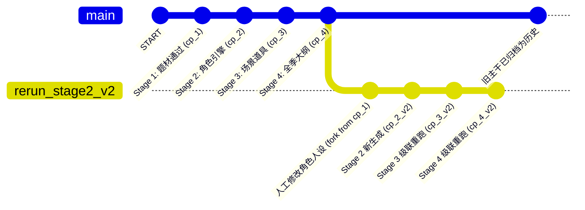
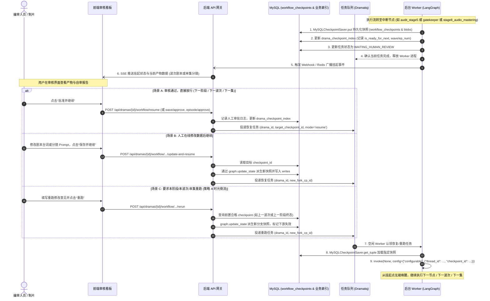

# 剧本创作工坊：基于 MySQL 持久化与时光倒流重跑的高韧性编排方案
## （策略 A 时光倒流、MySQL Checkpointer 协议复用、三级干预控制、断点挂起与无缝恢复）

---

## 一、 方案背景与架构演进定位

### 1.1 背景现状与核心瓶颈
在当前短剧工业化流水线（`industrial_master_graph.py`）中，系统已经具备了强大的两程九阶多智能体生成能力，且底层已在 [app/workflows/checkpointers/mysql_saver.py](app/workflows/checkpointers/mysql_saver.py) 中实现了符合 LangGraph 官方协议规范的 `MySQLCheckpointSaver`（继承 `BaseCheckpointSaver`）。然而，在实际业务与工业化量产推进中，仍面临以下关键瓶颈：

1. **协议层与业务层脱节，主图未接入持久化**：
   - 主图入口仍硬编码采用 `GLOBAL_GRAPH_CHECKPOINTER = MemorySaver()`，底层高质量的 `MySQLCheckpointSaver` 尚未在主图和单集子图中全面装配；
   - 现有的 `MySQLCheckpointSaver` 是纯粹的技术中间件，保存的是无序 UUID 的底层检查点，业务系统与前端无法根据“剧目 ID + 阶段（Stage）+ 集数（Episode）”直接定位到特定的业务快照。
2. **缺乏多层级干预控制流**：
   - 图结构采用静态全自动流转，Gatekeeper 虽然完成了文学定稿加锁，但未挂起流程；
   - 无法满足“每阶人工精细把关（强干预）”、“全季文学总审放行（两程干预）”和“批量快速铺量（全自动）”的差异化业务诉求。
3. **缺乏状态回溯与局部重跑治理**：
   - 当用户对某一阶段的生成成果（如角色人设、某集大纲、某集分镜）不满意时，缺乏安全合规的“时光倒流”机制；
   - 重跑容易造成新老数据混杂拼接（脏数据污染），或被迫推倒全剧重来，消耗大量昂贵的模型 Token。

### 1.2 架构演进定位：底层协议复用 + 上层业务增强（零冲突保证）
本方案并非推翻现有设计，而是确立**“底层完全复用现有 `BaseCheckpointSaver` 协议引擎，上层增强业务语义索引与时光倒流控制策略”**的分层演进架构：
- **底层（协议引擎）**：100% 沿用已有的 `MySQLCheckpointSaver` 及其三张核心表（`workflow_checkpoints`、`workflow_checkpoint_blobs`、`workflow_checkpoint_writes`），保持对 LangGraph 原生生态的零侵入与完全兼容；
- **业务层（索引与路由）**：新增 `drama_checkpoint_index` 业务索引表，建立业务语义与底层 UUID 的双向映射；
- **编排层（控制与重跑）**：通过主图编译参数 `interrupt_after` 实现三种控制模式，通过 LangGraph 原生 `update_state` + 级联失效实现策略 A（时光倒流分支重跑）。

---

## 二、 系统总体架构与分层数据流

```mermaid
flowchart TB
    subgraph ClientLayer [客户端与人机交互控制台]
        UI[Web 控制台 / 移动端审核看板]
        API[FastAPI 编排网关 / SSE 状态推流]
    end

    subgraph TaskLayer [分布式异步任务层 (Dramatiq Worker)]
        Worker[LangGraph 编排执行器]
        Queue[(任务队列: lmd_tasks)]
    end

    subgraph GraphLayer [LangGraph 工业全息主图]
        direction TB
        S1[Stage 1: 题材立项] --> A1[Audit 1 自审]
        A1 --> S2[Stage 2: 角色引擎]
        S2 --> A2[Audit 2 自审]
        A2 --> S3[Stage 3: 空间道具]
        S3 --> A3[Audit 3 自审]
        A3 --> S4[Stage 4: 全季大纲]
        S4 --> A4[Audit 4 自审]
        A4 --> S5[Stage 5: 文学剧本]
        S5 --> A5[Audit 5 自审]
        A5 --> GK[Stage 5: Gatekeeper 定稿总锁]
        GK --> S6[Stage 6: 资产提纯]
        S6 --> S7[Stage 7: 视听分镜]
        S7 --> S8[Stage 8: 音频工程]
    end

    subgraph SaverLayer [现有底层协议引擎: MySQLCheckpointSaver]
        BaseSaver[BaseCheckpointSaver 协议实现<br/>put / put_writes / get_tuple / list]
        TableCP[(workflow_checkpoints 表: 状态快照)]
        TableBlobs[(workflow_checkpoint_blobs 表: 通道独立版本)]
        TableWrites[(workflow_checkpoint_writes 表: 增量写入)]
    end

    subgraph BizRoutingLayer [新增业务增强索引层]
        TableIdx[(drama_checkpoint_index 表: 业务阶段与快照双向映射)]
        TimeTravelEngine[时光倒流与级联失效路由]
    end

    subgraph DomainDB [业务关系型数据库]
        BizDB[(MySQL 业务数据: dramas / screenplays / storyboards)]
    end

    %% 交互连线
    UI -->|1. 触发生成 / 审批 / 提交修改| API
    API -->|2. 投递任务 (含 thread_id / 目标 checkpoint)| Queue
    Queue -->|3. 认领任务| Worker
    Worker -->|4. 驱动状态图流转| GraphLayer
    GraphLayer <==>|5. 每超步通过 BaseCheckpointSaver 读写| BaseSaver
    BaseSaver <==> TableCP
    BaseSaver <==> TableBlobs
    BaseSaver <==> TableWrites
    
    GraphLayer -.->|节点/自审完成后登记业务快照| TableIdx
    TimeTravelEngine <==>|定位历史父检查点| TableIdx
    TimeTravelEngine -.->|标记下游旧数据失效| BizDB
    GraphLayer -.->|定稿或全季完成落库| BizDB
    Worker -->|6. 遇到中断挂起 / 释放 Worker| API
    API -->|7. SSE 推流挂起状态| UI
```

---

## 三、 MySQL 持久化 Checkpointer 架构设计与表结构对齐

现有的 [app/workflows/checkpointers/mysql_saver.py](app/workflows/checkpointers/mysql_saver.py) 已经实现了精细的通道级版本管理（`blobs`）与中间写入追踪（`writes`），新方案在此基础上平滑对齐，并新增业务索引表。

### 3.1 底层三表规范（沿用现有已落地表结构）

表结构完全对齐现有数据库迁移文件 [app/db/migrations/01_workflow_checkpoints.sql](app/db/migrations/01_workflow_checkpoints.sql)：

1. **`workflow_checkpoints`（核心状态快照主表）**：
   - 记录 `thread_id`, `checkpoint_ns`, `checkpoint_id`, `parent_checkpoint_id`, `type`, `checkpoint`, `metadata`, `created_at`, `updated_at`；
   - 索引覆盖 `(thread_id, checkpoint_ns, checkpoint_id)` 主键，以及父节点索引 `idx_wf_ckpt_parent`，**天然具备 DAG 分支追溯能力**。
2. **`workflow_checkpoint_blobs`（状态通道版本载荷表）**：
   - 按状态通道（State Channel）独立记录版本与载荷，主键为 `(thread_id, checkpoint_ns, channel, version)`；
   - 保证大状态修改时仅持久化发生变更的通道数据，大幅降低冗余存储与 I/O 开销。
3. **`workflow_checkpoint_writes`（中间写入追踪表）**：
   - 记录节点并发执行过程中的 `pending_writes`，确保时序正确与幂等重放。

### 3.2 业务增强表：`drama_checkpoint_index`（业务语义桥接表）

为了让上层业务（API、前端控制台、时光倒流路由）能够直观按阶段操作，新增专门的业务路由映射表：

```sql
CREATE TABLE IF NOT EXISTS `drama_checkpoint_index` (
    `id` BIGINT AUTO_INCREMENT PRIMARY KEY COMMENT '主键自增',
    `drama_id` INT NOT NULL COMMENT '业务剧目ID',
    `journey` ENUM('journey_1_literary', 'journey_2_visual') NOT NULL COMMENT '所属程',
    `stage` TINYINT NOT NULL COMMENT '阶段编号 (1~8)',
    `episode_number` INT NOT NULL DEFAULT 0 COMMENT '集数 (第一程为0，第二程对应实际集数)',
    `node_name` VARCHAR(64) NOT NULL COMMENT '产出此状态的节点名称 (如 audit_stage2, gatekeeper)',
    `checkpoint_id` VARCHAR(128) NOT NULL COMMENT '对应的 LangGraph 底层 checkpoint_id',
    `thread_id` VARCHAR(128) NOT NULL COMMENT '对应的 thread_id',
    `is_ready_for_next` TINYINT(1) NOT NULL DEFAULT 0 COMMENT '是否为本阶段合格就绪点 (自审通过或人工批准)',
    `audit_verdict` VARCHAR(32) NULL COMMENT '自审结论 (BLUE_PASS / RED_BLOCKING / HUMAN_APPROVED)',
    `version_tag` VARCHAR(32) NOT NULL DEFAULT 'v1' COMMENT '重跑版本标识 (v1, v2, v3...)',
    `is_current_active` TINYINT(1) NOT NULL DEFAULT 1 COMMENT '是否为当前最新激活分支',
    `created_at` DATETIME(3) NOT NULL DEFAULT CURRENT_TIMESTAMP(3) COMMENT '创建时间',
    INDEX `idx_lookup` (`drama_id`, `stage`, `episode_number`, `is_current_active`),
    INDEX `idx_cp` (`thread_id`, `checkpoint_id`)
) ENGINE=InnoDB DEFAULT CHARSET=utf8mb4 COLLATE=utf8mb4_unicode_ci COMMENT='短剧工业编排业务与检查点双向映射索引表';
```

### 3.3 大数据治理与性能优化
*   **载荷编码与压缩**：当前 `MySQLCheckpointSaver` 采用 `serde.dumps_typed` + Base64 编码，安全规避了字符集乱码；对于 Stage 5 后期全季文学剧本，可在 Serde 序列化层接入 `zstandard (zstd)` 压缩中间件，将大文本压缩比提升至 75% 以上，防止超出 MySQL `max_allowed_packet`。
*   **连接池复用**：`MySQLCheckpointSaver` 依赖全局 `session_scope` 或 SQLAlchemy `engine`，已具备连接池复用能力，高并发写入时不会耗尽数据库连接。

---

## 四、 策略 A：基于 Checkpoint 时光倒流 (Time Travel) 重跑全景方案

### 4.1 时光倒流核心哲学：分支派生而非物理覆盖
策略 A 恪守**“版本历史不可变、历史快照不销毁、分叉派生新版本”**的设计哲学：
*   当针对 Stage $N$ 发起重跑时，系统**绝不物理删除**该检查点之后已经生成的旧数据（如旧的大纲、旧剧本）。
*   系统以 Stage $N$ 对应的**前置就绪检查点**（Stage $N-1$ 的终态快照）为基准父节点，创建一条新的执行分支。
*   这样既保证了可以随时对比“修改前（v1）与修改后（v2）”的生成效果，又确保了状态机在任何时刻都具备可追溯性与确定性。



### 4.2 阶段重跑生命周期全流程

#### 第一步：精准定位前置锚定点 (Checkpoint Anchoring)
用户在控制台发起“重跑 Stage 2（角色引擎）”。
1. 后端查询 `drama_checkpoint_index` 表：
   - 查询条件：`drama_id = ? AND stage = 1 AND is_ready_for_next = 1 AND is_current_active = 1`。
   - 获取到 Stage 1 审计通过时的 `checkpoint_id`（记为 `target_parent_cp_id`）。
2. 该快照包含了 Stage 1 的全部确定性成果（确定的剧名、题材矩阵、核心卖点、反套路禁令），且尚未进入 Stage 2。

#### 第二步：注入人工修改并派生新快照 (State Fork & Update)
1. 用户在前端可能附带了修改要求（例如：“增强男二号的隐忍感与反派潜伏深度”），或者直接在表单上修改了某些字段。
2. 后端构建 LangGraph 恢复配置：
   ```python
   # 逻辑配置示意（规范方案，非执行代码）
   config = {
       "configurable": {
           "thread_id": f"drama_{drama_id}",
           "checkpoint_id": target_parent_cp_id  # 锚定回历史父快照
       }
   }
   ```
3. 调用 LangGraph 核心状态更新机制：
   - 执行 `update_state(config, values={"human_guidance_for_stage2": "...", ...}, as_node="audit_stage1")`。
   - LangGraph 底层 `MySQLCheckpointSaver` 在 MySQL 的 `workflow_checkpoints` 表中创建一条新的快照记录，其 `parent_checkpoint_id` 指向 `target_parent_cp_id`，生成全新的 `new_fork_cp_id`。
4. 将 `drama_checkpoint_index` 中此前针对 Stage 2~5 的历史快照标记为 `is_current_active = 0`，并插入新的索引记录，版本号升级为 `v2`。

#### 第三步：级联失效防御与业务脏数据标记 (Cascading Invalidation)
短剧创作具有强烈的上下文链式依赖（角色改变 $\rightarrow$ 场景道具改变 $\rightarrow$ 大纲动机改变 $\rightarrow$ 台词剧本改变）：
1. **业务数据库级联标记**：
   - 后端在业务数据库中，将该剧目下 Stage 2、Stage 3、Stage 4、Stage 5 的历史落库数据（若已落库）状态批量更新为 `DIRTY_INVALIDATED` 或 `ARCHIVED_HISTORY`。
   - 前端对应的剧本预览标签高亮提示：“由于角色人设重跑，后置大纲与剧本需重新生成”。
2. **清理状态机脏数据**：
   - 在新快照的状态中，将 `characters_engine`, `environments_and_props`, `season_outlines`, `completed_screenplays` 对应字段清空重置，防止脏数据污染下游。

#### 第四步：恢复驱动流转 (Resume Execution)
1. 向任务队列投递重跑任务：`{"action": "RESUME", "drama_id": drama_id, "checkpoint_id": new_fork_cp_id}`。
2. Worker 认领任务，以 `new_fork_cp_id` 为起点恢复图执行，状态机自动从 Stage 2 重新进入，按照配置的控制模式向下推进。

### 4.3 第二程单集独立时光倒流机制
第二程（Stage 6 资产提纯 $\rightarrow$ Stage 7 导演分镜 $\rightarrow$ Stage 8 全息混音）按集解耦：
1. **独立 Thread 架构**：
   - 每集分配独立的会话标识：`thread_id = f"drama_{drama_id}_ep_{episode_number}"`。
2. **单集重跑不伤及全季**：
   - 若用户仅对第 5 集的分镜不满意，发起“重跑第 5 集 Stage 7”：
   - 仅需定位 `drama_{drama_id}_ep_5` 线程中 Stage 6 完成时的 `checkpoint_id`；
   - 派生新快照并独立重跑第 5 集的子图，第 1~4 集与第 6~100 集的执行状态与检查点毫发无损。

---

## 五、 三种控制模式的设计与运行机制

系统通过主图编译时的 `interrupt_after`（或 `interrupt_before`）参数与状态机内的动态意图标记，解耦实现三种运行模式：

| 维度 | 模式一：强干预模式 (Stage-by-Stage) | 模式二：分两程干预模式 (Two-Journey) | 模式三：完全自动化模式 (Full-Auto) |
| :--- | :--- | :--- | :--- |
| **核心定位** | S级精品短剧、题材创新试验、新手编剧精调 | **工业化标准生产推荐核心模式** | 批量题材测爆率、出海快速铺量、全流程验证 |
| **挂起拦截点** | 每个 Stage 的 Audit 节点及第二程单集节点 | **仅在第一程文学定稿总锁 (`gatekeeper`) 处挂起** | **全流程 0 挂起**（除非出现不可恢复的系统异常） |
| **自审处置策略** | 自审通过后挂起等待人工确认；阻断则先自愈 | 第一程自审自动闭环自愈，直到全季剧本完成 | 自审自动闭环自愈；超限走兜底策略直通下游 |
| **第二程流转** | 单集生成后挂起，人工审核通过再跑下一集 | 第一程人工放行后，第二程可分集并发或自动流转 | 第二程按集全自动循环流转，直至整季输出 |
| **适用角色** | 资深总编审、制片人逐项把控 | 编剧团队统揽文学，视听工程交由技术流水线 | AI 自动化批量出海测试、短剧算法矩阵 |

### 5.1 模式一：强干预模式 (Stage-by-Stage Human Approval)
1. **编译配置**：
   `interrupt_after = ["audit_stage1", "audit_stage2", "audit_stage3", "audit_stage4", "gatekeeper", "stage8_audio_mastering"]`。
2. **流转行为**：
   - **Step 1**：执行 `stage1_ideation` $\rightarrow$ 执行 `audit_stage1`。
   - **Step 2**：若自审结论为 `RED_BLOCKING`，在允许重试次数（2次）内由系统自愈重跑；若自审通过（`BLUE_PASS`），由于配置了 `interrupt_after`，图在 `audit_stage1` 节点完成后**立即挂起**。
   - **Step 3**：Worker 检测到中断，将检查点持久化到 MySQL，更新任务状态为 `WAITING_HUMAN_APPROVAL`，释放执行线程。
   - **Step 4**：人工在前端审阅 Stage 1 成果。若满意，点击“批准”；若不满意，提出意见并触发重跑。
   - **Step 5**：人工批准后，后端调用恢复流程，图继续向下流向 `stage2_character`。

---

## 五、 三种控制模式的设计与运行机制

系统通过主图编译时的 `interrupt_after`（或 `interrupt_before`）参数与状态机内的动态意图标记，解耦实现三种运行模式：

| 维度 | 模式一：强干预模式 (Stage-by-Stage & Wave-by-Wave) | 模式二：分两程干预模式 (Two-Journey & Episode-by-Episode) | 模式三：完全自动化模式 (Full-Auto) |
| :--- | :--- | :--- | :--- |
| **核心定位** | S级精品短剧、题材创新试验、新手编剧精调 | **工业化标准量产核心模式（编审把控文学 + 逐集审核视听）** | 批量题材测爆率、出海快速铺量、全流程自动化压测 |
| **第一程拦截点** | Stage 1~4 每阶自审挂起；**Stage 5 每一波次生成后挂起**；Gatekeeper 定稿挂起 | Stage 1~5 自动推进自愈闭环，**仅在第一程定稿总锁 (`gatekeeper`) 处强制挂起** | **全流程 0 挂起**（除非出现不可恢复的系统异常） |
| **Stage 5 文学剧本机制** | **波次级强干预**：每波次（如 5 集）生成并自审后挂起，人工审核通过才跑下一波次，直至全剧生成完 | 全季文学剧本波次连续自动生成，红蓝自审自愈闭环，直至全剧生成完在 Gatekeeper 汇合 | 全季文学剧本波次连续自动生成，红蓝自审自愈闭环，全自动向下推进 |
| **第二程视听工程机制** | **逐集单线推进**：Stage 6~8 严格一集一集生成，每集混音完成后挂起，人工审核通过才跑下一集 | **逐集单线推进**：Stage 6~8 严格一集一集生成，每集混音完成后挂起，人工审核通过才跑下一集 | 第二程按集全自动循环流转，无需人工干预，直至整季输出 |
| **编译配置 `interrupt_after`** | `["audit_stage1", "audit_stage2", "audit_stage3", "audit_stage4", "audit_stage5", "gatekeeper", "stage8_audio_mastering"]` | `["gatekeeper", "stage8_audio_mastering"]` | `None` |
| **适用角色** | 资深总编审、制片人逐波次、逐集把控 | 编剧团队统揽文学大终审，导演与制片逐集把关视听分镜 | AI 自动化批量出海测试、短剧算法矩阵 |

### 5.1 模式一：强干预模式 (Stage-by-Stage & Wave-by-Wave)
1. **编译配置**：
   ```python
   interrupt_after = [
       "audit_stage1", "audit_stage2", "audit_stage3", "audit_stage4",
       "audit_stage5", "gatekeeper", "stage8_audio_mastering"
   ]
   ```
2. **第一程前期流转（Stage 1~4）**：
   - 执行 `stage1_ideation` $\rightarrow$ 执行 `audit_stage1`。
   - 若自审为 `RED_BLOCKING` 且未超限，由系统自愈重跑；若自审通过（`BLUE_PASS`），由于配置了 `interrupt_after`，图在 `audit_stage1` 完成后**立即挂起**。
   - Worker 持久化快照到 `workflow_checkpoints`，在 `drama_checkpoint_index` 记录 `stage=1, is_ready_for_next=1`，更新任务状态为 `WAITING_HUMAN_APPROVAL`，释放 Worker。
   - 人工审核通过后，调用恢复 API，流程向下流向 `stage2_character`，以此类推直至 Stage 4 审核完成。
3. **阶段五波次级干预流转（Stage 5 Wave-by-Wave Review）**：
   - `stage5_screenplay` 每次按 Mini-Arc 批次（如每波次 5 集）生成剧本；
   - 生成完毕后进入 `audit_stage5` 自审；
   - 自审完成后，由于 `"audit_stage5"` 在 `interrupt_after` 中，**图在每一波次完成后强制挂起**！
   - Worker 记录快照，并在 `drama_checkpoint_index` 中记录当前波次完成状态（如 `stage=5, episode_number=5, is_ready_for_next=1`）；
   - 人工在控制台审阅本波次的剧本草稿（台词、动作、钩子、卡点）：
     - **若满意**：调用波次放行 API（`/api/dramas/{id}/workflow/stage5/wave/approve`），调用 `invoke(None, config)` 恢复执行；
     - **条件路由判定**：`_route_after_stage5_audit` 检测到 `completed < total`，自动流转回 `stage5_screenplay` 执行下一波次（如第 6~10 集）；
     - 下一波次生成并自审后，**再次挂起**等待人工审核，循环往复；
     - 直至 `completed >= total`，所有剧本生成完毕，`_route_after_stage5_audit` 路由至 `gatekeeper`；
   - **定稿总锁挂起**：`gatekeeper` 完成数据冻结与入库，随后挂起等待全季文学最终签字定稿。
4. **第二程逐集干预流转（Stage 6~8 Episode-by-Episode Review）**：
   - 第一程定稿放行后，进入第二程；
   - 执行当前集（第 1 集）的 `stage6_asset_truth` $\rightarrow$ `stage7_storyboard_srt` $\rightarrow$ `stage8_audio_mastering`；
   - 由于 `"stage8_audio_mastering"` 在 `interrupt_after` 中，**当前集视听生成完毕后强制挂起**；
   - 人工审核第 1 集的分镜画面、运镜 Prompt、音频对白与混音质量；
   - 人工批准后调用单集放行 API，`route_episode_loop` 判定返回 `"next_episode"`，流经 `episode_increment`，进入第 2 集的 Stage 6~8；
   - 每集必须经过人工确认方可进入下一集，直至整季全部完成。

### 5.2 模式二：分两程干预模式 (Two-Journey Gatekeeper & Episode-by-Episode Review) —— **推荐核心量产模式**
1. **编译配置**：
   ```python
   interrupt_after = ["gatekeeper", "stage8_audio_mastering"]
   ```
2. **第一程流转行为（全自动推进与自审自愈）**：
   - Stage 1 $\rightarrow$ Audit 1 $\rightarrow$ Stage 2 $\rightarrow$ ... $\rightarrow$ Stage 5（文学剧本波次生成）；
   - 在此期间，红蓝自审全权负责质量把关，出现红牌自动自愈（最多 2 次），波次连续自动吐出，**期间不进行任何人工挂起**；
   - 全季文学剧本全部生成完毕后，自动流转至 `gatekeeper`（第一程定稿总锁）；
   - `gatekeeper` 节点完成全剧数据完整性核验、跨集一致性校验与数据库持久化；
   - 由于 `"gatekeeper"` 在 `interrupt_after` 中，**流程在此处发生第一程强制挂起**；
   - **全季文学大终审**：主创人员集中审阅全季大纲与全剧本，确认人物弧光与终极卡点。
3. **第二程流转行为（严格逐集生成与单集人工把关）**：
   - 人工审核并批准第一程定稿后，调用恢复 API，流程越过 `gatekeeper` 进入第二程；
   - **严格单集推进**：第 1 集执行 `stage6_asset_truth` $\rightarrow$ `stage7_storyboard_srt` $\rightarrow$ `stage8_audio_mastering`；
   - 由于 `"stage8_audio_mastering"` 在 `interrupt_after` 中，**第 1 集视音频生成完成后强制挂起**；
   - Worker 保存状态并释放，前端通知编审/制片：“第 1 积分镜与混音已就绪，请审核”；
   - 人工审阅第 1 集分镜与音频：
     - 若通过：调用单集批准 API，触发 `invoke(None, config)`，`route_episode_loop` 路由至 `episode_increment`，推进至第 2 集；
     - 若需修改：直接在线微调分镜 Prompt 或音轨参数，调用注入更新 API 后放行；
     - 若不满意：调用单集重跑 API，时光倒流重新生成第 1 集分镜；
   - 第 2 集按同样流程执行并挂起等待审核，**严格实现“一集生成 $\rightarrow$ 一集审核 $\rightarrow$ 再跑下一集”**，直至全季所有集数视听工程彻底交付！

### 5.3 模式三：完全自动化模式 (Fully Automated Pipeline)
1. **编译配置**：
   ```python
   interrupt_after = None
   ```
2. **流转行为**：
   - 编排图内不设置任何静态中断点；
   - 红蓝自审若遇红牌阻断，自愈重试 2 次；若超限触发安全保底策略，强制向下推进；
   - 跨越 Gatekeeper 时自动完成文学落库，直接切入 Stage 6~8，逐集循环直至全季分镜与混音工程彻底生成完毕，最终流向 `pipeline_complete` 终止。

---

## 六、 人工干预生命周期与异步挂起/恢复执行规范

为了在分布式高并发环境下实现稳定的人工干预，严禁采用内存 `while` 轮询或 `time.sleep` 等待，必须采用基于**“状态机外置挂起 + 异步任务队列解耦”**的标准事件驱动架构。

### 6.1 挂起与恢复完整时序流



### 6.2 挂起与恢复核心操作规范

#### 1. 任务挂起时的安全动作
- **快照完整性校验**：Worker 在捕获到 LangGraph 中断信号（`graph.get_state(config).next` 不为空）后，必须确认 MySQL 中对应 `checkpoint_id` 的记录已在 `workflow_checkpoints` 表物理 `COMMIT`。
- **状态登记**：在主业务表 `dramas` 中标记 `execution_status = 'PAUSED_PENDING_REVIEW'`，记录挂起时的 `current_stage`、`current_step`、`current_wave`、`current_episode` 与 `latest_checkpoint_id`。
- **Worker 优雅释放**：Worker 必须立即返回，结束当前消息消费，绝对不允许在 Worker 内部进行长连接等待。

#### 2. 状态注入（Update State）规范
- **使用 `update_state` 保证版本链完整**：
  人工修改数据时，严禁直接通过 SQL 语句强行篡改 `workflow_checkpoints` 表中的二进制或 Base64 内容。
  必须通过 LangGraph 官方提供的 `graph.update_state(config, values, as_node)` API 进行修改注入，确保底层 `MySQLCheckpointSaver` 自动在 `workflow_checkpoint_writes` 与 `workflow_checkpoints` 中生成版本增量记录与合法的新 `checkpoint_id`。
- **参数传递约定**：
  - `config`：必须明确指定 `thread_id` 以及待修改的父 `checkpoint_id`。
  - `values`：仅传递被修改的字段增量字典（如 `{"completed_screenplays": updated_screenplays}` 或 `{"characters_engine": updated_characters}`）。
  - `as_node`：明确声明该状态修改由哪个节点视作产出（例如声明为 `as_node="audit_stage5"` 或 `as_node="stage8_audio_mastering"`），以保证下游节点的条件路由能够正确判断前驱状态。

#### 3. 唤醒执行（Resume Invocation）规范
- **输入参数严格为 `None`**：
  当调用恢复执行时，传递给 `graph.invoke` 的首个入参必须为 `None`（或空字典）：
  ```python
  # 唤醒恢复调用的规范逻辑
  resume_config = {
      "configurable": {
          "thread_id": f"drama_{drama_id}",
          "checkpoint_id": latest_or_forked_checkpoint_id
      }
  }
  graph.invoke(None, config=resume_config)
  ```
  **原理解析**：向已挂起的图传递 `None`，意味着告知 LangGraph：“无需注入新的外部初始状态，直接从指定 `checkpoint_id` 冻结的内存镜像处无缝唤醒，并沿着图定义的下一步边（Edge）继续流转”。

---

## 七、 人工干预与状态机操作 API 完整规范

为了支撑 Web 控制台与编审看板的交互，系统在 FastAPI 编排网关层提供标准化的非阻塞 RESTful API。所有涉及人工审核、数据修改与重跑的 API 均遵循统一的“状态校验 $\rightarrow$ 快照操作/分支派生 $\rightarrow$ 任务入队”安全规范。

### 7.1 接口总览矩阵

| 接口分类 | HTTP 方法与路径 | 适用场景 | 核心状态机动作 |
| :--- | :--- | :--- | :--- |
| **查询** | `GET /api/dramas/{id}/workflow/pending-review` | 页面加载待审核数据 | 读取挂起节点快照，组装待审数据与自审报告 |
| **通用** | `POST /api/dramas/{id}/workflow/resume` | Stage 1~4、Gatekeeper 直接放行 | 记录 `is_ready_for_next=1`，唤醒 `invoke(None)` |
| **阶段五** | `POST /api/dramas/{id}/workflow/stage5/wave/approve` | 强干预模式批准当前波次 | 标记当前波次就绪，唤醒图流向下一波次 |
| **阶段五** | `POST /api/dramas/{id}/workflow/stage5/wave/update-and-resume` | 人工修改当前波次剧本并继续 | `update_state` 注入修改剧本，唤醒进入下一波次 |
| **阶段五** | `POST /api/dramas/{id}/workflow/stage5/wave/rerun` | 当前波次剧本不满意重跑 | 锚定上一波次终态，`update_state` 注入意见重跑 |
| **第二程** | `POST /api/dramas/{id}/workflow/episodes/{ep}/approve` | 两程/强干预批准当前集 | 标记单集完成，触发 `episode_increment` 进下一集 |
| **第二程** | `POST /api/dramas/{id}/workflow/episodes/{ep}/update-and-resume` | 人工微调单集分镜/音频并继续 | `update_state` 注入分镜，唤醒流向下一集 |
| **第二程** | `POST /api/dramas/{id}/workflow/episodes/{ep}/rerun` | 单集独立重跑 (Stage 6/7/8) | 锚定单集前置节点快照，独立重跑单集子图 |
| **重跑** | `POST /api/dramas/{id}/workflow/rerun-stage` | 第一程阶段级时光倒流重跑 | 锚定前置阶段终态，级联失效下游，派生新分支 |
| **控制** | `POST /api/dramas/{id}/workflow/pause` / `retry` | 紧急人工暂停 / 异常故障重试 | 发送中断信号 / 从最近安全检查点恢复 |

---

### 7.2 核心接口详细规格说明

#### 1. 获取当前挂起审核上下文 (`GET /pending-review`)
*   **请求路径**：`GET /api/dramas/{drama_id}/workflow/pending-review`
*   **响应示例**：
    ```json
    {
      "code": 200,
      "data": {
        "drama_id": 1001,
        "run_mode": "stage_by_stage",
        "current_stage": 5,
        "suspended_node": "audit_stage5",
        "checkpoint_id": "1ef634ab-5678-4321-9abc-def012345678",
        "wave_info": {
          "current_wave": 2,
          "total_waves": 20,
          "episodes_in_wave": [6, 7, 8, 9, 10],
          "total_completed_episodes": 10,
          "total_episodes": 100
        },
        "episode_info": null,
        "audit_report": {
          "verdict": "BLUE_PASS",
          "score": 92.5,
          "suggestions": ["第8集结尾钩子强度建议提升", "人物台词符合人物小传"]
        },
        "payload_preview": {
          "episodes": {
            "6": {"title": "暗潮涌动", "scenes_count": 4, "word_count": 1250},
            "7": {"title": "身份疑云", "scenes_count": 3, "word_count": 1180}
          }
        },
        "allowed_actions": ["approve", "update_and_resume", "rerun_wave"]
      }
    }
    ```

#### 2. 阶段五波次审核放行 (`POST /stage5/wave/approve`)
*   **请求路径**：`POST /api/dramas/{drama_id}/workflow/stage5/wave/approve`
*   **请求体**：
    ```json
    {
      "wave_index": 2,
      "approved_episodes": [6, 7, 8, 9, 10],
      "comment": "第2波次剧本节奏紧凑，准予通过"
    }
    ```
*   **内部状态机执行逻辑**：
    1. **检查锁**：获取 Redis 分布式锁 `lock:drama_exec:{drama_id}`；
    2. **校验快照**：查询 `drama_checkpoint_index`，确认当前处于 `audit_stage5` 挂起状态；
    3. **登记业务就绪**：将该波次对应的 checkpoint 记录标记为 `is_ready_for_next = 1, audit_verdict = 'HUMAN_APPROVED'`；
    4. **投递异步任务**：向 Dramatiq `lmd_tasks` 队列投递恢复消息：
       ```python
       resume_pipeline_task.send(
           drama_id=drama_id,
           target_checkpoint_id=current_checkpoint_id,
           action="RESUME_STAGE5_WAVE"
       )
       ```
    5. **Worker 恢复执行**：Worker 认领后调用 `graph.invoke(None, config)`。`_route_after_stage5_audit` 判定 `completed (10) < total (100)`，自动流转至 `stage5_screenplay` 执行第 3 波次（第 11~15 集），生成后再次自动于 `audit_stage5` 挂起。

#### 3. 阶段五波次人工修改并继续 (`POST /stage5/wave/update-and-resume`)
*   **请求路径**：`POST /api/dramas/{drama_id}/workflow/stage5/wave/update-and-resume`
*   **请求体**：
    ```json
    {
      "wave_index": 2,
      "episodes_patch": {
        "8": {
          "title": "暗夜抉择 (修改版)",
          "full_screenplay_text": "第8集 正文修改...",
          "cliffhanger_hook": "修改后的致命悬念钩子"
        }
      },
      "continue_next_wave": true
    }
    ```
*   **内部状态机执行逻辑**：
    1. **加载当前快照**：从 `MySQLCheckpointSaver` 加载当前的 `IndustrialDramaMasterState`；
    2. **局部更新剧本状态**：将 `episodes_patch` 中的修改合并到 `state.completed_screenplays` 字典中；
    3. **通过 `update_state` 派生新快照**：
       ```python
       new_config = graph.update_state(
           config={"configurable": {"thread_id": f"drama_{drama_id}", "checkpoint_id": current_checkpoint_id}},
           values={"completed_screenplays": state.completed_screenplays},
           as_node="audit_stage5"
       )
       new_checkpoint_id = new_config["configurable"]["checkpoint_id"]
       ```
    4. **更新索引表**：在 `drama_checkpoint_index` 插入新快照记录，标记为 `is_ready_for_next = 1`；
    5. **同步业务表**：将修改后的剧本持久化至业务表 `screenplays`；
    6. **恢复执行**：若 `continue_next_wave=true`，以 `new_checkpoint_id` 为起点投递恢复任务，启动下一波次生成。

#### 4. 阶段五波次重跑 (`POST /stage5/wave/rerun`)
*   **请求路径**：`POST /api/dramas/{drama_id}/workflow/stage5/wave/rerun`
*   **请求体**：
    ```json
    {
      "wave_index": 2,
      "human_guidance": "第7集和第8集剧情过平，需要增强主角与反派的正面言语交锋，重新设计结尾卡点。"
    }
    ```
*   **内部状态机执行逻辑**：
    1. **时光倒流定位**：在 `drama_checkpoint_index` 中查找第 1 波次完成时的合格快照（若为第 1 波次则查找 Stage 4 终态快照）作为 `parent_cp_id`；
    2. **状态注入与脏数据剔除**：
       - 将第 2 波次（第 6~10 集）的已生成剧本从 `completed_screenplays` 中剔除；
       - 注入 `human_guidance_for_stage5 = human_guidance`；
       - 通过 `graph.update_state(config, values, as_node="audit_stage4")` 派生新分支快照 `forked_cp_id`；
    3. **投递重跑任务**：Worker 以 `forked_cp_id` 唤醒图，重新执行 `stage5_screenplay` 生成第 2 波次。

#### 5. 第二程单集审核通过 (`POST /episodes/{ep}/approve`)
*   **请求路径**：`POST /api/dramas/{drama_id}/workflow/episodes/{episode_number}/approve`
*   **请求体**：
    ```json
    {
      "episode_number": 1,
      "comment": "第1集分镜与对白音频质量极佳，通过并生成第2集"
    }
    ```
*   **内部状态机执行逻辑**：
    1. **校验状态**：确认当前线程停留在 `stage8_audio_mastering`，且对应集数为 `episode_number`；
    2. **标记单集合格**：在 `drama_checkpoint_index` 中更新该集的 Stage 8 快照为 `is_ready_for_next = 1`；
    3. **业务数据定稿**：将该集的视听分镜（`storyboards`）与音频工程数据在业务数据库中标记为 `APPROVED`；
    4. **投递推进任务**：
       ```python
       resume_pipeline_task.send(
           drama_id=drama_id,
           target_checkpoint_id=current_checkpoint_id,
           action="NEXT_EPISODE"
       )
       ```
    5. **Worker 推进至下一集**：Worker 执行 `graph.invoke(None, config)`。
       - 流程流出 `stage8_audio_mastering`，触发条件边 `route_episode_loop`；
       - 判定当前集 `1 < total`，返回 `"next_episode"`；
       - 节点流向 `episode_increment`（将 `current_episode_index` 更新为 2）；
       - 随后流向 `stage6_asset_truth` 开始生成第 2 集的资产、分镜与音频；
       - 第 2 集在 `stage8_audio_mastering` 再次挂起等待审核。

#### 6. 第二程单集分镜/音频在线修改并继续 (`POST /episodes/{ep}/update-and-resume`)
*   **请求路径**：`POST /api/dramas/{drama_id}/workflow/episodes/{episode_number}/update-and-resume`
*   **请求体**：
    ```json
    {
      "episode_number": 1,
      "storyboards_patch": [
        {
          "shot_number": 3,
          "visual_prompt": "特写，主角眼神冷酷，带有逆光电影质感",
          "camera_movement": "慢速推近",
          "voice_emotion": "低沉冷静"
        }
      ],
      "audio_patch": {
        "bgm_volume": 0.35,
        "voice_style": "deep_cinematic"
      },
      "continue_next_episode": true
    }
    ```
*   **内部状态机执行逻辑**：
    1. 通过 `graph.update_state` 注入修改后的分镜与音频通道数据，生成新快照 `fork_ep_cp_id`；
    2. 同步更新业务表 `storyboards`；
    3. 若 `continue_next_episode=true`，以 `fork_ep_cp_id` 唤醒图，执行 `route_episode_loop` 进入下一集。

#### 7. 第二程单集独立重跑 (`POST /episodes/{ep}/rerun`)
*   **请求路径**：`POST /api/dramas/{drama_id}/workflow/episodes/{episode_number}/rerun`
*   **请求体**：
    ```json
    {
      "episode_number": 1,
      "from_stage": 7,
      "human_guidance": "分镜运镜节奏太慢，请切换为快切动感分镜，增加面部特写。"
    }
    ```
*   **内部状态机执行逻辑**：
    1. **定位单集前置快照**：查询第 1 集在 `from_stage - 1`（即 Stage 6 资产提纯完成）时的快照；
    2. **局部重置单集状态**：清空第 1 集的 `storyboards` 与 `audio_mastering` 状态，注入修改意见；
    3. **派生新分支**：调用 `update_state` 产生新检查点；
    4. **局部重跑**：仅重新执行第 1 集的 Stage 7 $\rightarrow$ Stage 8，其他集数不受任何影响。

#### 8. 通用阶段审核放行 (`POST /resume`)
*   **请求路径**：`POST /api/dramas/{drama_id}/workflow/resume`
*   **请求体**：
    ```json
    {
      "stage": 2,
      "comment": "角色小传与人物关系矩阵符合预期，批准进入空间道具阶段"
    }
    ```
*   **适用场景**：Stage 1~4 各阶自审通过后的人工确认放行，以及 Gatekeeper 全季文学定稿签署。
*   **内部状态机执行逻辑**：
    1. 校验当前挂起节点与 `stage` 匹配（如当前停在 `audit_stage2`）；
    2. 在 `drama_checkpoint_index` 中将当前快照的 `is_ready_for_next` 置为 1；
    3. 投递任务 `action="RESUME_STAGE"`；
    4. Worker 调用 `graph.invoke(None, config)`，流程顺畅流向下一阶段节点。

#### 9. 第一程阶段级时光倒流重跑 (`POST /rerun-stage`)
*   **请求路径**：`POST /api/dramas/{drama_id}/workflow/rerun-stage`
*   **请求体**：
    ```json
    {
      "target_stage": 2,
      "human_guidance": "主角性格需由霸道总裁改为深藏不露的卧底医生，整体反差感加强。",
      "override_payload": null
    }
    ```
*   **内部状态机执行逻辑**：
    1. **定位前置合格锚定点**：查询 `drama_checkpoint_index` 中 `stage = target_stage - 1`（即 Stage 1 终态）的最新合格快照；
    2. **级联失效**：在业务数据库中，将 Stage 2~5 的历史大纲与剧本标记为 `DIRTY_INVALIDATED`；
    3. **派生新快照**：调用 `graph.update_state` 注入 `human_guidance` 并重置被污染字段，生成新分支版本 `v2`；
    4. **投递重跑任务**：Worker 以新分支快照唤醒图，重新执行 Stage 2 及其后续流程。

#### 10. 紧急人工暂停与异常重试 (`POST /pause` & `POST /retry`)
*   **人工暂停**：`POST /api/dramas/{drama_id}/workflow/pause`
    - 在 Redis 中设置 `pause_flag:drama_{drama_id} = 1`；
    - Worker 在各节点执行前后检查该标志，若检测到暂停，立即在当前超步完成后安全退出，保存快照并更新状态为 `MANUALLY_PAUSED`。
*   **异常重试**：`POST /api/dramas/{drama_id}/workflow/retry`
    - 当节点因外部 LLM 接口超时、网络抖动抛出异常中断时；
    - 系统从 MySQL `workflow_checkpoints` 中检索最近一条合法快照，投递任务直接以该快照调用 `graph.invoke(None, config)` 进行断点重试。

---

## 八、 异常处理、并发竞争与生产安全体系

### 8.1 并发竞争与幂等恢复保护
1. **分布式互斥锁**：
   在发起 `resume` 或 `rerun` 操作时，后端必须在 Redis 或 MySQL 中对该剧目施加互斥锁（如 `lock:drama_exec:{drama_id}`，TTL=30秒），防止用户在前端因网络延迟连续多次点击“继续”，导致多个 Worker 同时唤醒同一线程发生状态覆盖冲突。
2. **幂等性校验**：
   Worker 在唤醒前，比对当前数据库中该剧目的 `active_checkpoint_id`。若发现传入的 `checkpoint_id` 已经被执行或已处于 `RUNNING` 状态，则直接拒绝重复执行并打印审计警告日志。

### 8.2 宕机与进程被杀后的自愈机制
若在执行计算密集型任务（如 Stage 5 批量写剧本、Stage 7 生图/分镜）过程中，Worker 发生 OOM、断电或机器重启：
1. **最后安全快照回溯**：
   系统启动时，健康巡检任务扫描所有处于 `RUNNING` 状态但心跳超时的剧目；
2. **安全恢复**：
   从 MySQL 中读取该剧目**最近一条已完整落库的 Checkpoint**。由于上一个超步的快照已经完整持久化，系统直接将任务重置为 `READY_TO_RETRY`，由新的 Worker 从最近的安全快照处重新唤醒，损失最多仅限于当前单个崩溃节点的计算量，全流程历史完全保全。

---

## 九、 实施推进步骤与验收标准

| 阶段 | 实施内容 | 交付产物与标准 |
| :--- | :--- | :--- |
| **第一阶段：Checkpointer 装配与索引建表** | 1. 执行 DDL 创建 `drama_checkpoint_index` 业务索引表；<br/>2. 将 `industrial_master_graph.py` 中的 `GLOBAL_GRAPH_CHECKPOINTER = MemorySaver()` 替换为现有的 `MySQLCheckpointSaver` 单例。 | 单元测试验证：主图运行后，MySQL 的 `workflow_checkpoints`、`workflow_checkpoint_blobs` 和 `drama_checkpoint_index` 中均有完整快照与索引记录，耗时控制在 50ms 以内。 |
| **第二阶段：三种控制模式接入** | 1. 扩展 `build_industrial_master_graph`，支持传入 `run_mode: Literal["stage_by_stage", "two_journey", "full_auto"]` 参数；<br/>2. 动态生成对应的 `interrupt_after` 节点配置（强干预模式配置 `audit_stage5` 波次挂起，两程干预模式配置 `stage8_audio_mastering` 逐集挂起）。 | 模式测试：强干预模式在每阶及 Stage 5 每一波次后正确挂起；两程模式在 Gatekeeper 与每集完成后正确挂起；全自动模式贯通全流程。 |
| **第三阶段：时光倒流与重跑机制** | 1. 实现基于 `drama_checkpoint_index` 的前置检查点快速定位能力；<br/>2. 封装波次级重跑、单集重跑与阶段级重跑业务逻辑，通过 `update_state` 派生新分支；<br/>3. 实现下游级联失效标记与脏数据清理。 | 场景验证：在 Stage 5 第 2 波次发起“重跑波次”，或在第 3 集发起“重跑单集分镜”，系统均能精准从前置锚定点派生新快照，且历史数据完整归档留痕。 |
| **第四阶段：前后端异步恢复与 API 联调** | 1. 提供 `pending-review`, `resume`, `wave/approve`, `wave/update-and-resume`, `episode/approve`, `episode/update-and-resume`, `rerun` 等全套标准 API；<br/>2. 联调 Dramatiq Worker 的挂起、状态同步与断点唤醒。 | 端到端联调：用户在前端界面能够完成“波次剧本审核 $\rightarrow$ 修改/重跑 $\rightarrow$ 文学定稿 $\rightarrow$ 逐集审核分镜 $\rightarrow$ 全流程交付”的工业级闭环。 |
