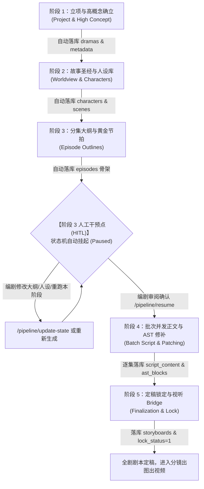

# 短剧剧本·全流程工业化创作 Skill (Drama Industrial Scriptwriter)

## 一、Skill 定位与核心架构

本 Skill 专为短剧工业化生产设计，**将 AI 创作逻辑与后端 Python LangGraph 状态机 (`app/workflows/langgraph_script_pipeline.py`) 及数据库 (`dramas`, `episodes`, `characters`, `scenes`, `storyboards`) 完全打通**：
1. **五阶段状态机解耦推进**：每个阶段产生强类型 JSON 数据，并自动调用 Python 对应持久化函数落库。
2. **阶段三 HITL 严格人工干预**：在阶段三大纲生成完毕后自动触发 `interrupt_after` 挂起，推送 SSE 事件通知编剧；编剧可在前端或通过接口调整大纲/人设，确认后再恢复执行（Resume）。
3. **支持任意阶段断点重跑与状态热更新**：支持基于 Checkpoint 重新运行特定阶段、原位修改节点状态以及触发下游资产级联刷新。

---

## 二、五阶段执行全景、JSON 契约与 Python 落库映射



> **阶段 JSON 结构 Schema 目录**：各阶段独立的强类型 JSON 规范文件已提取至 [stage_schemas/](stage_schemas/) 目录，详情请参见 [stage_schemas/README.md](stage_schemas/README.md)。

---

### 【阶段一：立项与高概念确立 (Project & High Concept)】

#### 1. 执行逻辑
- 解析用户创作诉求，生成 3 秒强视觉钩子、南方公园因果律四幕结构、受众画像与付费卡点预设。
- **调用 Python 服务**：`langgraph_script_pipeline.generate_concept_design_with_llm()`
- **Schema 定义文件**：[stage_schemas/stage1_concept_design.json](stage_schemas/stage1_concept_design.json)

#### 2. 标准输出 JSON 契约摘要
```json
{
  "hitl_passed": true,
  "title": "战神归来之龙王殿",
  "genre": "现代/都市逆袭",
  "target_audience": "18-45岁男性下沉市场，偏好身份反转与极致打脸",
  "episode_count": 80,
  "one_sentence_story": "隐姓埋名三年的战神龙王，在岳母逼迫离婚宴上迎回千亿财团认主。",
  "one_sentence_hook": "前3秒染血亲子鉴定甩在豪华订婚宴玻璃茶几上！",
  "core_contradiction": "主角想守承诺做个普通赘婿，但是豪门各方逼迫践踏尊严，因此必须亮明身份全网清算",
  "opening_3s_hook": "特写：骨节分明的手将一份染血的文件狠狠砸在玻璃茶几上，赫然露出【确认非亲生】红印",
  "ultimate_question": "当权力与财富唾手可得，是选择毁灭背叛者还是救赎昔日恩人？",
  "four_acts": {
    "cause": {"ep_range": "E01-E10", "title": "起因", "content": "赘婿受辱遭退婚，神秘信物暴露引来财团轰动"},
    "development": {"ep_range": "E11-E30", "title": "发展", "content": "主角层层解决家族危机，但幕后黑手联合各路势力打压"},
    "climax": {"ep_range": "E31-E60", "title": "高潮", "content": "终极宴会亮出龙王战令，全面清算内奸与敌对势力"},
    "ending": {"ep_range": "E61-E80", "title": "终局", "content": "收回所有资产，完成对救命恩人的承诺与自我和解"}
  },
  "clues": [
    {"id": "CLUE_001", "name": "染血平安锁", "tag": "核心信物", "tag_type": "primary", "buried_ep": "E01", "resolved_ep": "E10"}
  ],
  "audience_analysis": {
    "paywall_episodes": [
      {"episode": 10, "reason": "首波身份线索曝光，龙王令即将亮出断章"},
      {"episode": 15, "reason": "千亿财团直升机降落宴会厅第一阶段打脸"},
      {"episode": 20, "reason": "反派绑架关键人物，主角动用绝密特权"}
    ]
  }
}
```

#### 3. 对应 Python 数据库持久化
- **对应函数**：`_persist_stage1_to_db(state, project, high_concept, concept_design)`
- **写入表与字段**：
  - `dramas`: 更新 `title`, `description`, `genre`, `tags`, `total_episodes`, `metadata` (存入 `four_acts`, `clues`, `audience_analysis`, `opening_3s_hook` 等)。

---

### 【阶段二：故事圣经与人设库 (Story Bible & Characters)】

#### 1. 执行逻辑
- 确立 3-5 个降本主场景、人物完整小传、人物错误认知链、人物关系网与多线伏笔库。
- **调用 Python 服务**：`langgraph_script_pipeline.generate_bible_design_with_llm()`
- **Schema 定义文件**：[stage_schemas/stage2_story_bible.json](stage_schemas/stage2_story_bible.json)

#### 2. 标准输出 JSON 契约摘要
```json
{
  "hitl_passed": true,
  "worldview": {
    "era": "现代都市",
    "core_rules": ["商界以龙腾黑金卡为尊", "家族利益凌驾于亲情之上"],
    "primary_scenes": [
      {"name": "顾氏集团顶层总裁办", "type": "内景", "desc": "奢华冷峻，全景落地窗俯瞰全城", "visual_prompt": "modern luxury penthouse office, floor to ceiling windows, cinematic lighting"},
      {"name": "江城国际大酒店宴会厅", "type": "内景", "desc": "金碧辉煌，名流汇聚的水晶吊灯大厅", "visual_prompt": "grand luxury banquet hall, crystal chandeliers, crowd in evening dress"}
    ]
  },
  "characters": [
    {
      "name": "顾沉舟",
      "identity": "隐世战神/千亿龙商继承人",
      "visual_anchor": "剑眉冷眸，右侧眉骨有一道浅伤疤，身穿深灰挺括羊绒大衣",
      "core_desire": "查明当年父母车祸真相并报恩",
      "fatal_flaw": "偏执多疑，不信任何人",
      "error_belief_chain": {
        "initial_belief": "只要隐忍付出就能换来真心与安稳",
        "shattering_event": "第1集亲眼目睹结婚三年的妻子将救命信物扔给情敌",
        "transformation": "唯有掌控绝对权力与真相，才能守护所爱之人"
      },
      "voice_profile": {"tone": "沉稳冷冽", "speed": "中速偏慢", "catchphrase": "你只有三秒时间考虑。"}
    },
    {
      "name": "林浅",
      "identity": "林家养女/表面势利心机女/实际隐忍调查者",
      "visual_anchor": "清冷桃花眼，右眼角有一颗泪痣，常着干练白色西装套裙",
      "core_desire": "借豪门之手保护身患重病的弟弟并寻找亲生父母",
      "fatal_flaw": "习惯独自承担所有痛苦而不作解释"
    }
  ],
  "character_relationships": [
    {
      "from_char": "顾沉舟",
      "to_char": "林浅",
      "surface_relation": "即将离婚的怨偶",
      "true_relation": "二十年前救命恩人与报恩者",
      "known_secret": "顾沉舟已知林浅递交了离婚协议",
      "hidden_secret": "林浅隐藏了当年为救顾沉舟落下病根的秘密"
    }
  ],
  "foreshadowing_clues": [
    {
      "id": "F01",
      "name": "刻字平安锁",
      "buried_ep": 1,
      "reinforced_ep": 5,
      "resolved_ep": 10,
      "surface_meaning": "普通地摊便宜货",
      "true_meaning": "全球龙商会唯一信物",
      "mislead_direction": "以为是前夫留下的垃圾"
    }
  ]
}
```

#### 3. 对应 Python 数据库持久化
- **对应函数**：`_persist_stage2_to_db(state, worldview, characters, bible_design)`
- **写入表与字段**：
  - `characters`: 自动插入/更新角色名、外貌视觉锚点 (`appearance_description`)、人设描述、提示词、`voice_profile`、`stages`；
  - `scenes`: 自动插入 3-5 个主场景名称、场景描述、`image_prompt`；
  - `dramas.metadata`: 存储人物关系矩阵 (`character_matrix`) 与伏笔库 (`foreshadowing_registry`)。

---

### 【阶段三：分集大纲与黄金节拍 (Episode Outlines) —— 包含 HITL 人工干预】

#### 1. 执行逻辑
- 生成全剧每一集的大纲、商业属性标签（投流/付费）、3秒钩子与结尾断章。
- **调用 Python 服务**：`langgraph_script_pipeline.generate_outlines_with_llm()`
- **Schema 定义文件**：[stage_schemas/stage3_episode_outlines.json](stage_schemas/stage3_episode_outlines.json)

#### 2. 标准输出 JSON 契约
```json
{
  "episode_outlines": {
    "1": {
      "episode_num": 1,
      "title": "假千金逼签离婚协议",
      "commercial_tag": "投流爆点",
      "primary_scene": "江城国际大酒店宴会厅",
      "opening_3s_action": "特写：亲子鉴定与离婚协议被狠狠砸在茶几上，玻璃出现裂痕",
      "main_obstacle": "全场宾客与反派当众辱骂逼迫下跪",
      "conflict_climax": "主角冷笑反手掌掴跳梁小丑，神秘豪车车队已抵楼下",
      "info_disclosure": "露出贴身佩戴的古旧平安锁一角",
      "foreshadowing_buried": ["F01"],
      "cliffhanger_hook": "定格在主角眼神转冷，门外响起顶级财团恭迎龙王的通报声！",
      "duration_sec": 90
    },
    "10": {
      "episode_num": 10,
      "title": "龙王金令现世",
      "commercial_tag": "黄金付费卡点",
      "primary_scene": "顾氏集团顶层总裁办",
      "opening_3s_action": "反派持枪逼近，主角端坐老板椅纹丝不动",
      "conflict_climax": "主角甩出漆黑龙令，反派幕后靠山当场吓瘫跪地",
      "cliffhanger_hook": "定格在靠山颤抖说出当年车祸元凶名字的前半句，枪声突然响起——"
    }
  }
}
```

#### 3. 对应 Python 数据库持久化与 HITL 状态机中断
- **对应函数**：`_persist_stage3_to_db(state, outlines)`
- **写入表与字段**：
  - `episodes`: 预占位插入/更新全集标题 (`title`)、集数 (`episode_number`)、大纲字段与状态 (`status='outline_ready'`)；
- **HITL 触发机制**：
  - 若 `hitl_mode=True`，状态机在节点 `outline_generation` 结束后**自动挂起**（`interrupt_after=["outline_generation"]`）；
  - 将当前检查点快照写入 `pipeline_checkpoints` 表（`status='paused_hitl'`）；
  - 触发发布 SSE 事件 `hitl_interrupt`，前端提示用户审阅。

---

### 【阶段四：批次受控并发正文与 AST 修补 (Batch Script & Patching)】

#### 1. 执行逻辑
- 编剧确认恢复（Resume）后，通过 `Send API` 按 2-3 集一组批次并发生成；
- 每集通过 `ScriptASTParser` 提取场景头、视听动作标（△）、角色对白，执行五阶质检（QA Critic）；
- 若质检不达标，触发 `TargetedPatchRouter` 对缺陷 AST 块进行原位局部手术式修补（最多重试 3 次）。
- **Schema 定义文件**：[stage_schemas/stage4_batch_script_ast.json](stage_schemas/stage4_batch_script_ast.json)

#### 2. 标准输出 JSON 契约摘要
```json
{
  "episode_num": 1,
  "title": "假千金逼签离婚协议",
  "body_markdown": "### 第 1 集：假千金逼签离婚协议\n**【商业定位】** 投流爆点\n**【场景】** 日 内 江城国际大酒店宴会厅\n**【人物】** 顾沉舟、林浅、林母\n**【核心道具】** 染血的离婚协议、平安锁\n\n**【视听动作与正文】**\n△ 开场特写（前3秒钩子）：一只骨节分明的手将一份染血的协议狠狠砸在玻璃茶几上，文件滑出，红印刺目。\n△ 镜头拉开，顾沉舟眼神冷冽如刀。林浅站在门边，脸色惨白。\n\n**顾沉舟**（冷笑，一步步逼近）：\n养了你三年，你就拿这份协议当礼物送我？\n\n**林浅**（眼眶泛红，勾起讥讽冷笑）：\n顾总既然早就查到了，何必还在大家面前装深情丈夫？\n\n△ 顾沉舟一把扼住林浅手腕，林浅怀里掉出一枚刻着“舟”字的古旧平安锁。\n\n**【片尾定格与悬念钩子】**\n△ 顾沉舟瞳孔瞬间收缩——那是他寻找了二十年的信物！\n△ 镜头定格在顾沉舟惊骇扑向信物的动作，剧烈心跳心电图音效戛然而止！\n△ 片尾字幕悬念：【抛下信物的林浅，究竟才是真正的救命恩人，还是早有预谋的复仇者？】",
  "ast_blocks": {
    "scene_headers": ["日 内 江城国际大酒店宴会厅"],
    "action_blocks": [
      {"type": "特写 CU · 极速推镜", "text": "【主体: 顾沉舟 | 动作: 染血协议重重砸向玻璃茶几 | 光影: 顶光冷冽】开场3秒引爆悬念。"},
      {"type": "中景 MS · 快速摇镜", "text": "【主体: 顾沉舟/林浅 | 动作: 顾沉舟扼住手腕，平安锁滑落 | 光影: 侧逆光】情绪极致对抗。"}
    ],
    "dialogue_blocks": [
      {"character": "顾沉舟", "emotion": "冷笑逼近", "text": "养了你三年，你就拿这份协议当礼物送我？"},
      {"character": "林浅", "emotion": "讥讽冷笑", "text": "顾总既然早就查到了，何必还在大家面前装深情丈夫？"}
    ],
    "ending_hook": "顾沉舟瞳孔瞬间收缩，那是他寻找了二十年的信物！"
  },
  "qa_report": {
    "score": 92,
    "hook_passed": true,
    "paywall_passed": true,
    "issues": []
  }
}
```

#### 3. 对应 Python 数据库持久化
- **对应函数**：`_persist_stage4_worker_result_to_db(drama_id, version_cursor, worker_result)`
- **写入表与字段**：
  - `episodes`: 更新 `script_content` (完整 Markdown 文本)、`ast_blocks` (AST 结构化 JSON)、`status='approved'`、`qa_score=92`。

---

### 【阶段五：定稿锁定与视听 Bridge (Finalization & Bridge)】

#### 1. 执行逻辑
- 全剧正文生成完毕，自动冻结版本游标，将 `dramas.lock_status` 置为 1；
- 自动触发 **Script-to-Visual Bridge**，将 AST 动作块与场景人设转换为 `storyboards` 分镜表与 `music_cues` 音效表，打通后续出图出视频。
- **调用 Python 服务**：`_persist_stage5_to_db(state)`
- **Schema 定义文件**：[stage_schemas/stage5_visual_bridge.json](stage_schemas/stage5_visual_bridge.json)

#### 2. 对应 Python 数据库持久化
- **写入表与字段**：
  - `dramas`: `lock_status=1`, `pipeline_status='completed'`, `version_cursor=version_cursor+1`；
  - `storyboards`: 为每一集插入镜头序列（含 `shot_type`, `angle`, `action`, `dialogue`, `image_prompt`, `video_prompt`）；
  - `music_cues`: 插入分镜配乐与音效点位数据。

---

## 三、人工干预 (HITL) 与中间阶段重跑操作手册

### 1. 阶段三触发人工干预并修改状态 (HITL Update)
当工作流运行到阶段三暂停后，编剧可直接修改大纲或人设，并通过 API/Python 方法原位覆写状态机：

- **HTTP 接口**：`POST /api/v1/dramas/{drama_id}/pipeline/update-state`
- **Python 方法**：`update_pipeline_state_for_drama(drama_id, updates, as_node="outline_generation")`
- **请求 Payload 示例**：
```json
{
  "as_node": "outline_generation",
  "updates": {
    "episode_outlines": {
      "10": {
        "episode_num": 10,
        "title": "【人工修改】龙王令反转曝光",
        "commercial_tag": "黄金付费卡点",
        "cliffhanger_hook": "主角亮出真实战神身份，全场倒吸凉气！"
      }
    },
    "characters": {
      "顾沉舟": {
        "name": "顾沉舟",
        "fatal_flaw": "【人工补充】对昔日恩人极度重情，导致易受情感软肋牵制"
      }
    }
  }
}
```

### 2. 审阅通过后恢复工作流 (Resume)
编剧确认大纲无误后，唤醒状态机执行阶段四与阶段五：

- **HTTP 接口**：`POST /api/v1/dramas/{drama_id}/pipeline/resume`
- **Python 方法**：`resume_script_pipeline_for_drama(db, drama_id)`

### 3. 重跑中间某个阶段 (Rerun Intermediate Stage)

| 场景需求 | 操作方法 | 底层 Python 机制 |
| :--- | :--- | :--- |
| **重跑阶段 1（立项与高概念）** | 调用 `/pipeline/start` 传入更新的 `user_prompt` | 重置状态机，全量重走 1-5 阶段 |
| **重跑阶段 2（故事圣经/人设）** | 针对指定短剧解锁 `lock_status=0`，调用 `/pipeline/update-state` 传入更新后的 `characters` 或 `worldview` | 更新 Checkpoint 并标记下游大纲与正文需要级联更新 |
| **重跑阶段 3（分集大纲）** | 在挂起状态下直接传入新的 `episode_outlines` 字典覆写 | 覆写后调用 `/pipeline/resume`，下游阶段四将自动按新大纲生成 |
| **单集局部修补与重跑 (Stage 4 Patch)** | 调用 `/dramas/{drama_id}/episodes/{ep_num}/patch` 传入质检意见 | 调用 `TargetedPatchRouter` 进行 AST 级手术式单集原位重写 |

---

## 四、核心工业化铁律 (Quality Gates)

1. **强类型契约**：大模型输出必须能严格解析为指定 JSON Schema，严禁输出无结构的纯小说文本。
2. **严禁越级执行**：阶段四的并发 Worker 必须且只能依赖阶段三确认的大纲和阶段二的人设，杜绝自由发挥产生设定冲突。
3. **定稿锁定保护**：一旦阶段五定稿 (`lock_status=1`)，全剧剧本禁止无权限篡改，下游视听资产严格以 AST 分镜为准。
4. **统一标准规范简体中文**，严禁使用网文小说旁白代替镜头语言。
5. **严禁无端编造**：涉及法律、医疗、金融等行业常识，无法核实时标注 `[需要行业核实]`。
6. **设定一致性原则**：已确认的设定绝不擅自推翻；若因剧情需要修改，必须先出具《改动连锁影响清单》。
7. **拒绝虚假反转与降智**：所有重大剧情逆转必须能回溯前文铺垫，禁止机械降神（Deus Ex Machina）。
8. **主动去套路化**：识别陈旧烂俗桥段，主动提供更具视听冲击力的高级替代方案。
