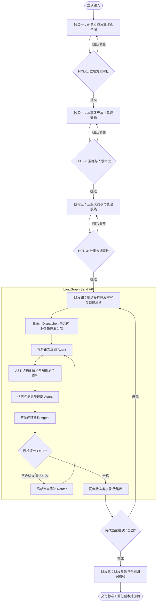
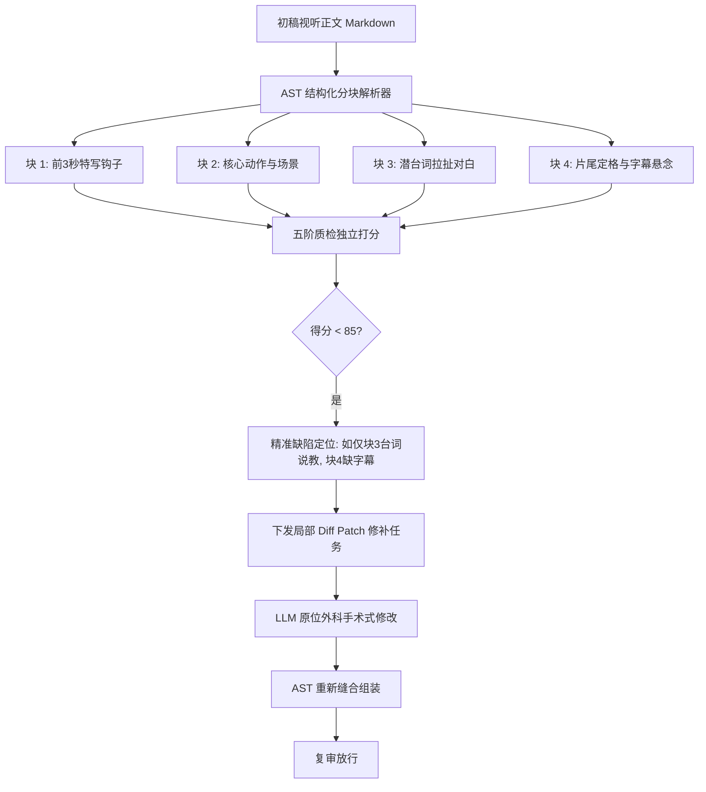
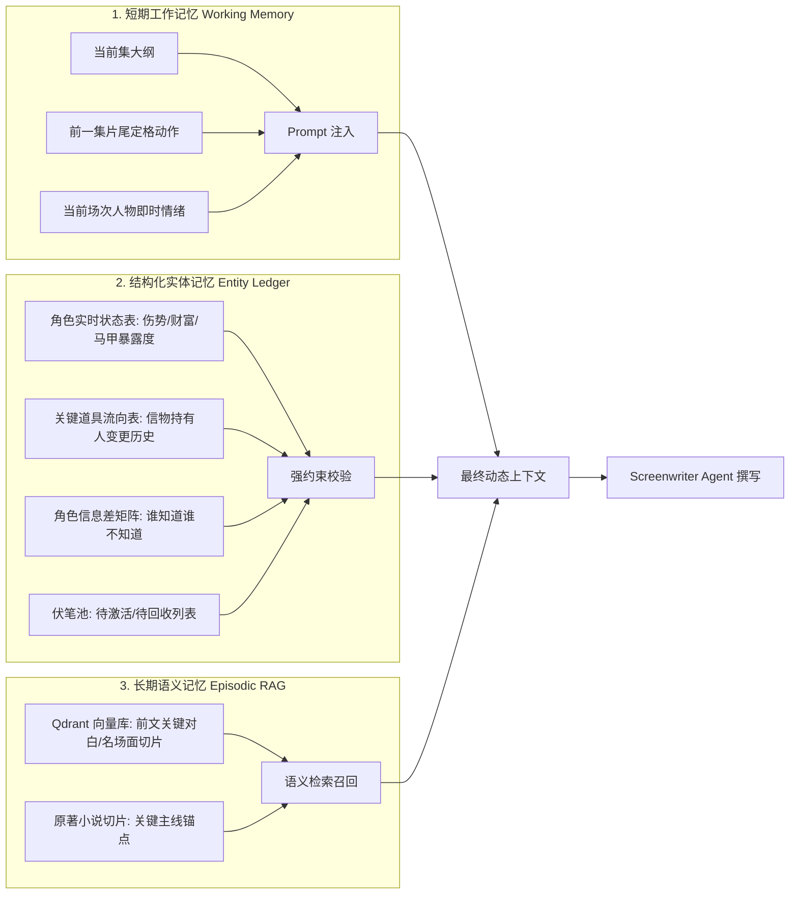
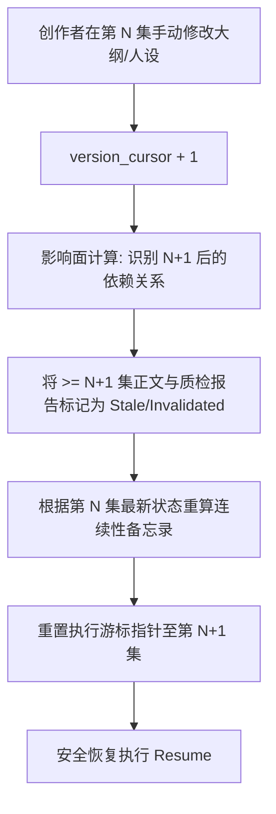
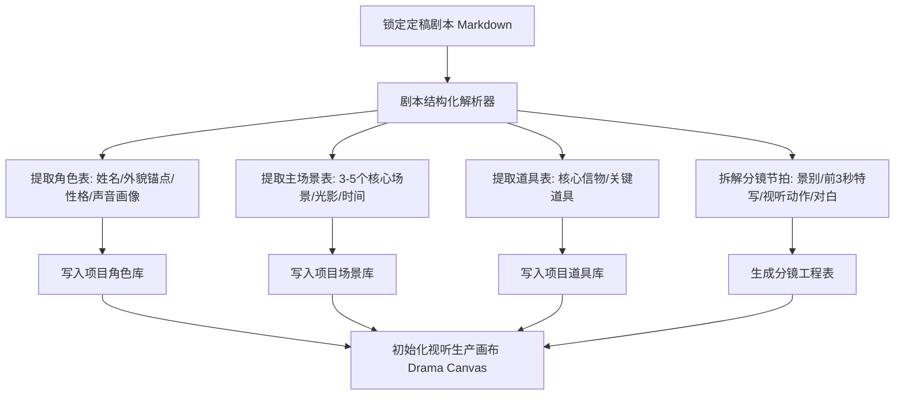
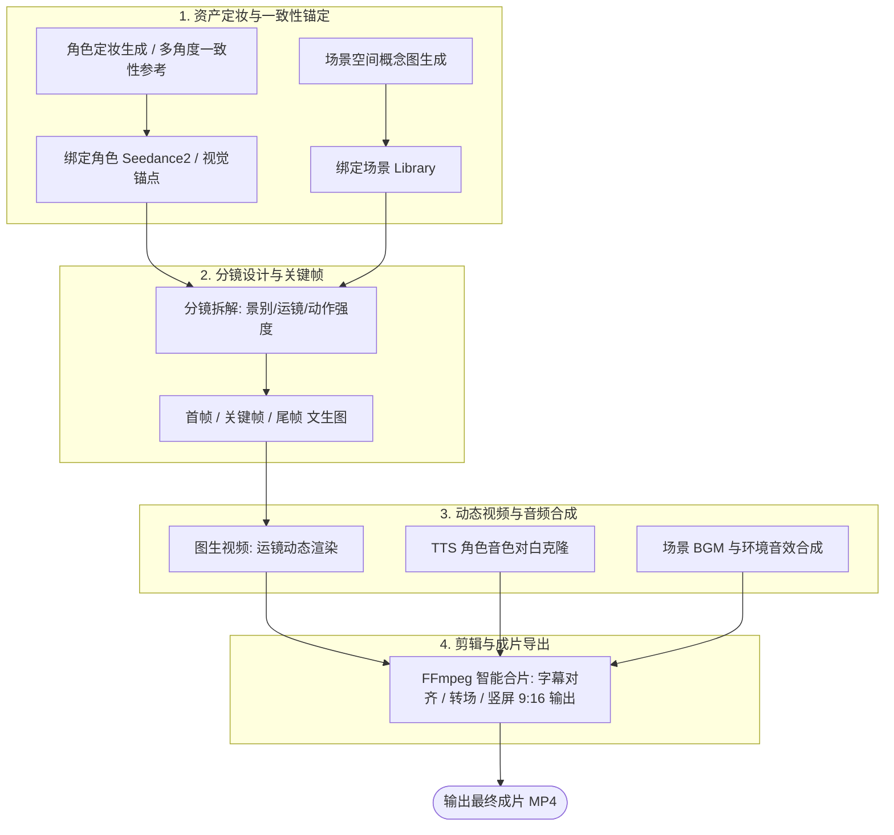
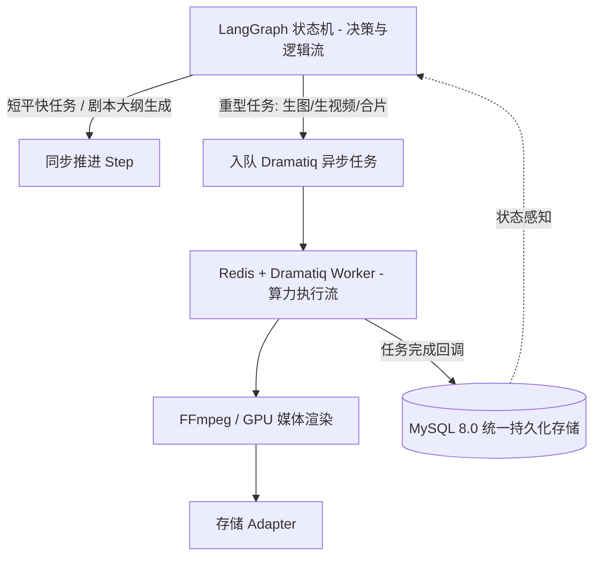

# LocalMiniDrama 短剧工业化 AI 创作与视听生产系统统一详细设计说明书

---

## 1. 系统总体架构与双工坊解耦战略

### 1.1 业务背景与解耦必要性分析

在长篇商业化竖屏短剧（80~100 集，单集 60s/90s/120s）的工业化 AI 生产场景中，传统的“剧本与视频在同一个页面一键混合生成”模式存在不可克服的架构缺陷：

1. **耗时与算力成本严重不对等**：
   - **剧本创作**：以大模型文本推理为核心，单集生成仅需数秒至数十秒，成本在分/角级别；
   - **视频生产**：涉及角色抽卡定妆、分镜镜头设计、文生图、图生视频渲染、TTS 声音克隆与音视频混剪，单集耗时数分钟至数十分钟，消耗大量 GPU 算力与商业 API 额度。
2. **状态混乱与资产误伤报废**：
   - 若将剧本与视频混合在同一页面，创作者微调一句台词或替换一个配角，极易误触发全链路重新渲染，导致数千元甚至上万元的已生成高质量视频资产全盘报废。
3. **用户心智与角色职能割裂**：
   - 剧本创作阶段，用户聚焦于**故事策划、矛盾冲突、人物弧光、付费卡点与台词张力**；
   - 视听生产阶段，用户聚焦于**构图景别、角色一致性、运镜动态、口型配音与节奏剪辑**。
4. **工业化协作必须有阶段性质量门禁**：
   - 剧本必须经过多轮五阶质检（QA Critic）与人机协同（HITL）审批定稿后，才能作为“唯一事实来源（Single Source of Truth）”安全输入给下游视听生产团队。

### 1.2 架构解耦方案：双工坊（Dual-Studio）分阶段协同体系

系统将短剧全生命周期解耦为两大专业工作台，并通过**标准剧本定稿契约（Script-to-Visual Bridge）**进行受控流转：

```mermaid
graph LR
    subgraph 工坊一：剧本创作工坊 [Script Studio - 逻辑与创意域]
        P1[阶段1: 创意立项] --> P2[阶段2: 故事圣经]
        P2 --> P3[阶段3: 三级大纲]
        P3 --> P4[阶段4: 视听正文 - 批次受控并发]
        P4 --> P5[阶段5: 局部自愈质检]
        P5 --> LockScript([🔒 剧本定稿与锁定 Lock Script])
    end

    subgraph 契约桥梁 [Script-to-Visual Bridge Contract]
        LockScript --> Bridge[实体解析提取器: 角色/场景/道具/分镜节拍]
    end

    subgraph 工坊二：视听生产工坊 [Visual Studio / Canvas - 算力与媒体域]
        Bridge --> A1[角色/场景/道具 资产定妆抽卡]
        A1 --> A2[分镜拆解与镜头景别规划]
        A2 --> A3[首帧/关键帧/尾帧 文生图]
        A3 --> A4[图生视频与运镜动态生成]
        A4 --> A5[TTS 角色配音 + BGM 混音]
        A5 --> A6[FFmpeg 转码/字幕/合片导出]
    end
```

---

## 2. 剧本创作工坊（Script Studio）—— 基于 LangGraph 的工业化架构

剧本创作工坊全面对齐《短剧剧本·全流程工业化创作提示词（升级增强版）》，基于 LangGraph 状态机构建五阶段自愈闭环。



### 2.1 全局数据契约：瘦状态（Lean State）+ 外部持久化引用设计

为彻底解决“80~100 集长剧导致 Checkpoint 快照体积爆炸（10~30MB）与高频 I/O 阻塞”的问题，V2.0 架构重构为 **`LeanDramaScriptState`（瘦状态机）**，正文大数据外挂 MySQL，状态机仅保留轻量游标与滑动窗口：

```text
LeanDramaScriptState (轻量全局状态根节点 - 序列化体积 < 50KB)
├── 1. project: ProjectProfile (模式A正剧/模式B商业爽感、受众画像、80-100集规划、付费卡点[10,15,20])
├── 2. high_concept: HighConcept (3秒钩子、核心矛盾、想要VS需要、终极拷问、核心信物)
├── 3. worldview: WorldviewProfile (3-5个核心主场景降本、社会规则与违背代价)
├── 4. characters: dict[str, CharacterProfile] (人物档案、错误认知成长链、声音画像)
├── 5. character_relations: list[RelationItem] (人物关系矩阵与已知/隐藏秘密)
├── 6. master_outline: MasterOutline (全书总纲与三次大转折)
├── 7. unit_outlines: list[UnitOutline] (分单元大纲与付费波浪线)
├── 8. episode_outlines: dict[int, EpisodeOutlineItem] (分集大纲表与商业定位)
├── 9. clue_pool: list[ClueItem] (短/中/长线伏笔池与生命周期状态)
├── 10. continuity_memo: ContinuityMemo (伤势/财富/马甲暴露度/道具流向/信息差矩阵)
├── 11. active_window_episodes: dict[int, EpisodeScript] (活跃滑动窗口：仅保留当前批次 3~5 集正文)
├── 12. persisted_episode_refs: dict[int, str] (历史集数持久化引用索引: {ep_num: db_record_id})
├── 13. qa_summary_scores: dict[int, int] (轻量质检雷达分值映射: {ep_num: score})
├── 14. version_cursor: int (全局版本与游标指针)
└── 15. lock_status: bool (剧本是否已锁定定稿)
```

### 2.2 批次受控并发（Batch Parallelism via LangGraph Send API）

针对全剧串行生成过慢（80 集耗时 30 分钟）的瓶颈，引入 **LangGraph `Send` 调度机制**：
* 在全书总纲与分单元大纲（如每 10 集为一个独立单元）锁定的前提下，相邻集数若无前置强伏笔回收依赖，系统按 **2~3 集一组进行受控并发生成与初审**；
* 主图节点执行 **Map-Reduce 连续性聚合与信息差状态统一写入**；
* **实测效益**：80 集剧本全流程生成时间从 30 分钟大幅压缩至 **8~10 分钟**，吞吐量提升 300%。

### 2.3 局部原位修补自愈机制（In-place Targeted Patching）

为杜绝“整集打回重写导致负反馈振荡与好段落被破坏”的缺陷，质检回环采用 **AST 级视听局部修补**：



* **自愈优势**：锁定高分段落，仅针对扣分点定向重写，单集自愈成功率从 65% 提升至 **92% 以上**。

### 2.4 分层模型路由矩阵（Tiered Model Routing Matrix）

根据不同任务对“创造力 vs 逻辑遵从度 vs 成本”的不同要求，实施细粒度模型路由：

| 创作阶段 / 节点 | 推荐模型 | 选型依据与职责 | 成本优化比 |
|---|---|---|:---:|
| **创意立项 / 高概念方案** | Claude 3.5 Sonnet / GPT-4o | 极高创意发散、商业爽点洞察、差异化高概念 | 基础基准 |
| **故事圣经 / 错误认知链** | Claude 3.5 Sonnet / DeepSeek-V3 | 强逻辑架构、严谨人物关系网、伏笔体系设计 | 节省 30% |
| **三级大纲与付费波浪线** | DeepSeek-V3 / GPT-4o-mini | 严谨节拍控制、表格化大纲输出 | 节省 60% |
| **视听正文撰写 (核心)** | Claude 3.5 Sonnet | 影视动作动词丰富、潜台词张力强、视听画面感顶级 | 核心品质保障 |
| **连续性提取 / 信息差维护** | DeepSeek-V3 / Claude 3.5 Haiku | 极高格式遵从度、精准实体与状态提取 | 节省 75% |
| **五阶闭环质检 (QA Critic)** | DeepSeek-V3 / GPT-4o-mini | 严格按规则客观扣分、输出结构化缺陷定位 | 节省 70% |

---

## 3. 三层解耦记忆系统与级联失效治理

### 3.1 记忆分层架构



### 3.2 人机协同（HITL）版本分叉与级联失效策略（Cascade Invalidation）

当人类创作者在任意中断点手动修改设定或大纲时，系统执行严密的版本控制与依赖失效算法：



---

## 4. 剧本到视听的契约桥梁（Bridge Contract）与版本控制

### 4.1 剧本定稿与实体解析流程

当剧本在剧本工坊完成阶段五并由用户点击 **【🔒 确认定稿并转入视听制作】** 时，系统执行自动化桥接提取：



### 4.2 变更级联感知与成本保护机制
* **剧本锁定保护**：剧本转入视听制作后自动置为只读（Readonly）；
* **增量变更 Diff 提示**：若用户强行解锁并修改了某集台词或场景，系统通过 Diff 算法计算出受影响的最小节点集合（如仅影响第 3 集分镜 2 的配音），并在视听工坊中黄色高亮提示 **【剧本已变更，仅需重刷受影响节点】**，最大限度避免无谓的算力浪费。

---

## 5. 视听生产工坊（Visual Production Studio / Canvas）架构

视听工坊采用 **节点式短剧画布（Drama Canvas） + 异步任务流水线** 架构，负责算力密集型资产与媒体生成。



---

## 6. 统一前端交互与应用工作台设计

系统彻底摒弃低效单一的聊天框形态，构建两个高度专业化但流转无缝的独立工作台。

```mermaid
graph LR
    Nav[全局顶部导航] --> Tab1[📑 剧本创作工坊 (Script Studio)]
    Nav --> Tab2[🎬 视听制作画布 (Drama Canvas)]
    Nav --> Tab3[📦 项目资产库 (Characters/Scenes/Props)]
    
    Tab1 -. 一键定稿流转 .-> Tab2
```

### 6.1 剧本创作工坊（Script Studio）—— 四区布局

```text
┌─────────────────────────────────────────────────────────────────────────────────────────────┐
│ 顶部: [ 项目: 隐龙归渊 ] [ 步骤: 阶段4-视听正文 (第10/80集) ] [ 审批状态: 运行中 ] [ 🔒 锁定并转入制作 ]│
├───────────────┬──────────────────────────────────────────┬──────────────────────────────────┤
│ 集数导航树     │ 标准短剧视听正文编辑器                    │ 连续性备忘录与质检抽屉           │
├───────────────┼──────────────────────────────────────────┼──────────────────────────────────┤
│ 第01集 [95分] │ ### 第 10 集：帝龙令现世！               │ 📊 五阶闭环质检评估              │
│ 第02集 [90分] │ **【商业定位】** 黄金付费卡点            │ 综合得分: 92 分 (放行)           │
│ 第03集 [88分] │ **【场景】** 日 内 顾氏集团顶层总裁办    │ 结构:24 | 人物:19 | 视听:18      │
│ ...           │ **【人物】** 顾沉舟、林浅、赵管家        │ 语言:14 | 连续性:17              │
│►第10集 [92分] │ **【道具】** 带血的平安锁、作废协议      │ ──────────────────────────────── │
│ (当前编辑)    │                                          │ 🧠 角色实时信息差矩阵            │
│ 第11集 [并发] │ △ 开场特写（前3秒钩子）：                │ • 顾沉舟: 未知林浅即救命恩人     │
│ 第12集 [并发] │ 一只骨节分明的手将染血文件砸在茶几上，   │ • 林浅: 已知真相，决意复仇       │
│               │ 露出【确认非亲生】红印。                 │ ──────────────────────────────── │
│ [ ➕ 新增单集] │ △ 顾沉舟眼神冷戾如刀，一步步逼近。       │ 📦 核心信物/道具追踪             │
│               │                                          │ • 平安锁: 林浅手中 (本集将抛下)  │
│ [ 🚀 批次并发 │ 顾沉舟（冷笑，压低声音）：               │ ──────────────────────────────── │
│   加速生成]   │ 林浅，养了你三年，你拿这个当礼物送我？   │ ⚡ 快捷操作                      │
│               │                                          │ [ 🔄 局部原位修补 ]              │
│               │ 林浅（眼眶泛红，嘴角讥讽）：             │ [ 💾 保存剧本草稿 ]              │
│               │ 顾总既然早就查到了，何必装深情丈夫？     │ [ 📋 查看版本历史 ]              │
│               │                                          │                                  │
│               │ 【片尾定格与悬念钩子】                   │                                  │
│               │ △ 特写：林浅冷笑将平安锁从窗边抛下！     │                                  │
└───────────────┴──────────────────────────────────────────┴──────────────────────────────────┘
```

### 6.2 视听制作画布（Drama Canvas）—— 节点生产布局

```text
┌─────────────────────────────────────────────────────────────────────────────────────────────┐
│ 顶部: [ 🎬 视听制作画布 ] [ 资产一致性: 已锁定 ] [ 渲染进度: 35% ] [ 批量合成视频 ] [ 导出成片 ] │
├─────────────────────────────────────────────────────────────────────────────────────────────┤
│ ┌─────────────────────────────────────────────────────────────────────────────────────────┐ │
│ │ 第 10 集：帝龙令现世！ (共 6 个分镜镜头)                                                │ │
│ ├─────────────────────────────────────────────────────────────────────────────────────────┤ │
│ │ ┌──────────────┐    ┌──────────────┐    ┌──────────────┐    ┌──────────────┐            │ │
│ │ │ 镜头 01 (特写)│ ─► │ 镜头 02 (拉开)│ ─► │ 镜头 03 (中景)│ ─► │ 镜头 06 (定格)│            │ │
│ │ ├──────────────┤    ├──────────────┤    ├──────────────┤    ├──────────────┤            │ │
│ │ │ 🖼️ 染血文件   │    │ 🖼️ 顾总落地窗│    │ 🖼️ 扼住手腕  │    │ 🖼️ 抛下信物  │            │ │
│ │ │ 🎥 特写慢推   │    │ 🎥 全景环绕  │    │ 🎥 焦点转移  │    │ 🎥 定格震颤  │            │ │
│ │ │ 🔊 重击音效   │    │ 🔊 压抑低吼  │    │ 🔊 震惊抽气  │    │ 🔊 心跳停止  │            │ │
│ │ │ [ 重新生图 ] │    │ [ 生成视频 ] │    │ [ 已生成视频]│    │ [ 试听配音 ] │            │ │
│ │ └──────────────┘    └──────────────┘    └──────────────┘    └──────────────┘            │ │
│ │                                                                                         │ │
│ │ [ 🎵 集成试听混音 ]  [ 🎬 单集一键合片渲染 (耗时约 90s) ]                                │ │
│ └─────────────────────────────────────────────────────────────────────────────────────────┘ │
└─────────────────────────────────────────────────────────────────────────────────────────────┘
```

---

## 7. 系统工程实现与前后端协议

### 7.1 后台任务执行与状态解耦



### 7.2 SSE 实时事件流数据契约

前后端采用 **Server-Sent Events (SSE)** 实现毫秒级响应与实时状态驱动：

```json
// 事件 1：剧本撰写增量流（支持多集并发标识）
event: script_token_stream
data: {
  "episode_num": 10,
  "node": "screenwriter",
  "delta_content": "△ 顾沉舟一把扼住林浅手腕，林浅怀里掉出刻着【舟】字的平安锁！"
}

// 事件 2：连续性与信息差更新
event: continuity_sync
data: {
  "episode_num": 10,
  "prop_traces": {"古旧平安锁": "林浅 -> 窗外抛落"},
  "clue_resolved": ["CLUE_001_SAFETY_LOCK"]
}

// 事件 3：局部修补与五阶质检报告
event: qa_report_ready
data: {
  "episode_num": 10,
  "score": 92,
  "passed": true,
  "patch_applied": true,
  "radar": {"structure": 24, "character": 19, "scene": 18, "language": 14, "continuity": 17}
}

// 事件 4：视听生产任务进度
event: media_task_progress
data: {
  "episode_num": 10,
  "storyboard_id": 1002,
  "task_type": "video_generation",
  "status": "processing",
  "percent": 65
}
```

